# Sentinel v2 — Execution Plan

Everything remaining, sequenced, with an exit test on every milestone. Companion to
[PRD.md](PRD.md), [HLD.md](HLD.md), [LLD.md](LLD.md) and [TECHNICAL.md](TECHNICAL.md).

The single ordering principle: **twenty valid answer files exist as early as possible.** That is the
submission gate. Everything before M5 exists to reach it; everything after raises the score.

---

## Contents

1. [Where the build stands](#1-where-the-build-stands)
2. [Work breakdown](#2-work-breakdown)
3. [Parallel tracks](#3-parallel-tracks)
4. [Milestones and exit tests](#4-milestones-and-exit-tests)
5. [Timeline](#5-timeline)
6. [Testing and CI](#6-testing-and-ci)
7. [Risk register](#7-risk-register)
8. [Definition of done](#8-definition-of-done)
9. [Submission checklist](#9-submission-checklist)
10. [Demo-day runbook](#10-demo-day-runbook)
11. [Cut list](#11-cut-list)

---

## 1. Where the build stands

### Done and verified

| | Evidence |
|---|---|
| Graph loaded on Savanna, TigerGraph 4.2.5 | Live counts read this session: Transaction 590,742 · Card 14,317 · Customer 13,553 · ClosedCase 5,565 · DeviceProfile 9,704 · Alert 20 · FraudCase 1 |
| 16 GSQL queries installed and callable | All executed live at 0.7–1.1 s; `scripts/test_tools.py` passes **34 assertions** across 13 calls in 4.3 s |
| Policy engine R1–R10 | `pytest tests/` → **40 passed** |
| Calibrated ledger | `elt.json`, 29 features in 11 groups, fitted on 14,055 positives vs 300,602 card-matched controls |
| Answer-file validator | `eval/validate.py`, 280 lines, shape + routing + SAR + graph-id + exposure arithmetic |
| One golden answer file | `cases/HHG-003.json`, hand-built, 11 evidence items |
| Planning and write-ups | PRD, BUILD_PLAN, LOADING, HAND_INVESTIGATION, TOOLS_AND_MCP, CALIBRATION |

### Not started

| | Consequence |
|---|---|
| **No agent** — zero LLM calls in the repo | Every integration seam is unexercised code |
| **No GraphRAG** — `PolicyDoc` is 0 rows, `ClosedCase.emb` empty on all 5,565 | A **required component** is missing, and `evidence[].source == "document"` is unreachable |
| **No evidence simulator** | Nothing can make `final` differ from `initial` |
| **No API, no UI** | A **required component** is missing |
| **19 of 20 answer files** | The submission itself |
| No demo video, blog post, social post | |

### Environment facts that are tasks, not assumptions

- **There is no dependency manifest** — no `pyproject.toml`, no `requirements.txt` — and no virtualenv at the repo root. This is task **B1** and it blocks everything.
- `.env` is populated and the graph is reachable; `TG_API_TOKEN` **expires 2026-09-27**.
- `tigergraph-mcp` is **not on PATH**, so the configured MCP server fails with `ENOENT`. MCP is a required component (task **G5**).
- `eval/fit_elt.py` reads `data/staging/transactions.csv`, which exists only as `transactions.csv.gz`. Refitting `elt.json` would fail today.

---

## 2. Work breakdown

Estimates are **person-hours**. Dependencies use task ids.

### Track P — Platform and refactor

| id | Task | Deps | h |
|---|---|---|---|
| P1 | `backend/pyproject.toml`, venv, `pip install -e`, CI skeleton, ruff + mypy config | — | 1.0 |
| P2 | `Settings` (pydantic-settings), regenerate `.env.example` with `OPENAI_*`, fix `.gitignore` | P1 | 0.7 |
| P3 | `GraphRepository` ABC + `TigerGraphRestRepository` over httpx: cold-start detection, token re-mint, concurrency gate | P2 | 2.0 |
| P4 | `ResponseNormalizer` — flatten, alias-strip, sentinel sanitisation (`-1.79e308`, `1970-01-01`) | P3 | 0.8 |
| P5 | 16 typed DTOs + `ToolRegistry` + `GraphTool` with JSON schemas + `QueryLog` + `EvidenceRef` | P4 | 2.5 |
| P6 | Port `test_tools.py`'s 34 assertions to `tests/live/` | P5 | 0.8 |
| P7 | `evidence/` — `EvidenceLikelihoodTable`, `EvidenceLedger` (**group-cap fix**), `Posting`; add the `analyst_request` prior | P2 | 1.2 |
| P8 | `FeatureExtractor` — all 29 features from DTOs, including the `-1` alert sentinel and `device_key == ""` handling | P5, P7 | 2.0 |
| P9 | `policy/` package — `PolicyEngine`, `RoutingTable`, `SarPolicy`, `StoppingPolicy`, 6 gate classes, `PolicyConfig` | P2 | 1.5 |
| P10 | **Port the 40 policy tests**, add gate tests and the contrary-evidence cap test | P9, P7 | 0.8 |
| P11 | `domain/answer.py` Pydantic models + the 10 model validators | P2 | 1.2 |
| P12 | `validation/` — `AnswerValidator` (pure) + `GraphIdentityChecker` (batched, distinguishes not-found from lookup-failed) | P11, P3 | 1.5 |
| P13 | `CaseStateBuilder` — wires `ledger.independent_support()` into `CaseState.independent_signals` | P7, P9 | 0.7 |
| P14 | `memory/CaseMemoryStore` — write-back with 6 edge types + `emb`; delete the smuggled keys and the interpolated GSQL | P3, P11 | 1.2 |
| | | | **17.9** |

### Track G — Graph and GraphRAG

| id | Task | Deps | h |
|---|---|---|---|
| G1 | Write the 10 new GSQL queries and install them in **one pass** (§LLD 3.4) | — | 2.5 |
| G2 | `CorpusBuilder` — chunk Guide.md by rule, the 5 patterns, the glossary; fetch and extract the FinCEN/FFIEC documents | P2 | 2.0 |
| G3 | `EmbeddingService` + ingest: `PolicyDoc` write, `ClosedCase.emb` for 5,565 rows at 256 dims, idempotent and resumable | G2, P3 | 2.0 |
| G4 | `VectorIndex` + `GraphRagRetriever` — cosine shortlist, structural ranking, RRF fusion, graph expansion for provenance | G3, P5 | 2.5 |
| G5 | `pip install tigergraph-mcp`, repoint `.mcp.json` at the venv binary, `setup_mcp.py --check` green | P1 | 0.5 |
| G6 | Retrieval evaluation — recall of HHG-003's six hand-found closed cases | G4 | 0.5 |
| | | | **10.0** |

### Track A — Agent

| id | Task | Deps | h |
|---|---|---|---|
| A1 | `InvestigationOrchestrator` ABC, `SentinelOrchestrator`, `InvestigationContext`, `StepCounter`, `EventEmitter`, `BudgetGuard` | P5, P7, P9 | 2.5 |
| A2 | `LlmClient` + `CostMeter` + `PromptLibrary` — structured output, retries, usage accounting | P2 | 1.5 |
| A3 | Steps `scope`, `plan`, `sweep` + `PlannerAgent` | A1, A2, P8 | 2.5 |
| A4 | Step `recall` over the hybrid retriever | A1, G4 | 1.0 |
| A5 | Step `assess` + `AssessmentAgent` + `DevilsAdvocateAgent` | A2, A3 | 2.0 |
| A6 | `EpisodeScoper` — deterministic, per pattern; exposure arithmetic | P5, P8 | 1.5 |
| A7 | `EvidenceSimulator` — four branches from measured bases | P8, A1 | 1.5 |
| A8 | Steps `stop_test`, `request_evidence`, `decide` | A1, P9, A7 | 1.0 |
| A9 | Step `narrate` + `NarrationAgent` — SAR grounded in the FinCEN chunk | A2, G4 | 1.5 |
| A10 | Step `write` + `AnswerAssembler` + write-back + quarantine of invalid answers | P11, P12, P14 | 1.5 |
| A11 | `ScriptedOrchestrator` from the HHG-003 fixture — **ships day one, unblocks the frontend** | A1 | 1.0 |
| A12 | `ReplayOrchestrator` from the event journal | A1, S3 | 0.5 |
| A13 | Integration test: full run against `FakeGraphRepository` + stub LLM | A10 | 1.0 |
| A14 | **Run all 20 cases chronologically**, inspect, fix, re-run | A13, G4 | 3.0 |
| | | | **22.0** |

### Track S — API service

| id | Task | Deps | h |
|---|---|---|---|
| S1 | App factory, `Container`, `RouterController`, error envelope, middleware, `/health`, `/ready`, `/meta` + **TypeScript contract emitter** | P2 | 2.0 |
| S2 | SQLite store: 6 mapped classes + repositories | S1 | 1.5 |
| S3 | `EventJournal` + `SseBroker` + `JournalingEventEmitter` + SSE endpoint with `Last-Event-ID` replay | S2 | 2.0 |
| S4 | Cases: list, detail, answer, trace, validation, write-to-graph | S2, P12 | 1.5 |
| S5 | Investigations: start, list, get, cancel; `RunRegistry`; concurrency cap | S3, A1 | 1.5 |
| S6 | Actions: 9 handlers covering 14 actions, `RoutePermissionPolicy`, `ActionExecutionService`, audit, idempotency | S2, P9 | 2.5 |
| S7 | Approvals: enqueue on 403, decision endpoint, route re-assertion | S6 | 1.0 |
| S8 | Graph canvas, memory, SAR endpoints | G1, S4 | 1.5 |
| S9 | Benchmark: batch run + report (verdict mix, block rate, SAR rate, histogram, warnings) | S5 | 1.0 |
| | | | **14.5** |

### Track F — Frontend

| id | Task | Deps | h |
|---|---|---|---|
| F1 | Next.js scaffold, fonts, `tokens.css`, Tailwind config, `cn`, app shell | — | 1.5 |
| F2 | **Design-system primitives** — Button, Chip, RouteBadge, VerdictChip, StatusChip, PatternChip, Panel, DataTable, RefChip, EntityChip, SourceIcon, Tabs/Dialog/Drawer/Tooltip/Toast shells, EmptyState, Skeleton | F1 | 3.5 |
| F3 | API client + TanStack Query hooks + the generated contract | F1, S1 | 1.0 |
| F4 | Case queue: filters, sort, search, keyboard model | F2, F3, S4 | 1.5 |
| F5 | Case detail, static: case pane, evidence list, SAR tab, memory tab | F2, F3, S4 | 2.5 |
| F6 | `InvestigationStream` + `TimelineStore` + live timeline + `ConnectionBadge` | F3, S3 | 2.0 |
| F7 | `ProbabilityMeter` + `ProbabilityTrajectory` | F2, F6 | 1.5 |
| F8 | Action panel, `ActionRow`, `ActionDiff`, the 403 flow and its notice | F2, S6 | 1.5 |
| F9 | Approvals inbox + `RoleSwitcher` + audit view | F2, S7 | 1.5 |
| F10 | Graph canvas (React Flow) | F2, S8 | 2.0 |
| F11 | Benchmark screen | F2, S9 | 1.0 |
| F12 | Fixture mode, empty/loading/error states, a11y pass, responsive pass | F5–F11 | 2.0 |
| | | | **21.5** |

### Track Z — Score and ship

| id | Task | Deps | h |
|---|---|---|---|
| Z1 | **Calibration review** — read all 20 outputs and ask of each: would I defend this to a fraud manager? Adjust ELT weights where the answer is no | A14 | 2.5 |
| Z2 | Ring discovery over `ring_expand_2hop` + client-side components; the undocumented-pattern cluster | G1, A14 | 2.0 |
| Z3 | Autonomous monitoring beyond the 20 → `exploration/` | A14 | 1.5 |
| Z4 | Repo polish: README, architecture diagram, ten-minute setup | — | 1.5 |
| Z5 | Demo video, 3–5 min, recorded from a replayed journal | F12, A12 | 2.5 |
| Z6 | Technical blog post, six required sections | A14 | 2.0 |
| Z7 | Social post tagging @TigerGraphDB | Z6 | 0.3 |
| | | | **12.3** |

**Total: ≈ 98 person-hours.** Against 20–28 wall-clock hours this needs 3–4 people working in
parallel, or an aggressive cut list (§11). The plan below assumes **three tracks in parallel**.

---

## 3. Parallel tracks

The scheduling trick is that every track codes against a **contract that exists before its
dependency does**.

| Track | Owner | Codes against | Unblocked at |
|---|---|---|---|
| **Platform + Agent** | Engineer 1 | The domain classes in [LLD.md](LLD.md) | immediately |
| **Graph + RAG** | Engineer 2 | The GSQL query signatures and `PolicyDoc` schema | immediately — the schema already exists |
| **API + Frontend** | Engineer 3 | The **SSE event types** and the endpoint table in [TECHNICAL.md](TECHNICAL.md), plus `ScriptedOrchestrator` | immediately |

Three contracts make that possible, and all three are already written down:

1. **`ScriptedOrchestrator` (A11) ships first.** It replays a fixture journal derived from
   `cases/HHG-003.json` with realistic delays, so the entire frontend — timeline, trajectory,
   actions, approvals — is built and demoable before the agent exists.
2. **The TypeScript contract is emitted from the Python enums (S1).** The frontend never waits for
   an endpoint to learn what `Action` is.
3. **`FakeGraphRepository` needs no network.** Agent work continues while the workspace is asleep
   and while Engineer 2 is installing queries.

---

## 4. Milestones and exit tests

| # | Milestone | Exit test |
|---|---|---|
| **M0** | Environment real | `pip install -e backend` succeeds; `pytest backend/tests/unit -q` runs; `ruff` and `mypy --strict backend/sentinel` clean |
| **M1** | Domain ported | **40 policy tests pass from their new home**, import line only; the 34 live tool assertions pass through `GraphRepository`; `AnswerValidator` accepts `cases/HHG-003.json` with no network |
| **M2** | Tools typed and agent-ready | `ToolRegistry.describe()` returns ≥ 16 JSON schemas; a scripted 12-call sweep on HHG-003 reproduces every number in [HAND_INVESTIGATION.md](../HAND_INVESTIGATION.md) |
| **M3** | GraphRAG live | `PolicyDoc` count > 0; `ClosedCase.emb` populated on 5,565 rows; `GraphRagRetriever` surfaces ≥ 4 of HHG-003's 6 hand-found closed cases in its top 10 |
| **M4** | One case end to end | `python -m sentinel.cli run --case HHG-003` writes a file that passes `eval.validate` **with graph checks**, reports non-zero `tokens`, and produces ≥ 1 `source: "document"` evidence item |
| **M5** | **THE GATE — 20 answer files** | 20 files present; `python -m eval.validate` exits 0 with graph checks; block rate ≤ 0.50; SAR rate ≤ 0.20; no verdict exceeds 60 % of the pack; ≥ 6 cases have `initial` ≠ `final`; ≥ 1 case cites a Sentinel case written earlier in the same run. **Tag `v1-submittable`** |
| **M6** | Console usable | A case renders from real data; a live investigation streams; reconnecting mid-run replays with no gap or duplicate |
| **M7** | Permission boundary demonstrable | In the browser: execute an L2 action as analyst → 403 naming `fraud_manager` → switch role → approve → action executes → one audit row with the approval reference |
| **M8** | Score raised | Calibration review applied to all 20; ring discovery output in `exploration/`; the undocumented-pattern question answered either way |
| **M9** | Shipped | Video recorded, blog published, social posted, README lets a judge start the system in ten minutes |

---

## 5. Timeline

Twenty-eight wall-clock hours, three parallel tracks. `T+` is hours from now.

```mermaid
gantt
    title Sentinel v2 — 28 hours, three tracks
    dateFormat HH
    axisFormat %H

    section Platform + Agent
    P1 P2 manifest, settings        :a1, 00, 2h
    P3 P4 P5 repo, tools            :a2, after a1, 5h
    P7 P9 P10 ledger, policy, tests :a3, after a2, 3h
    P8 P11 P13 features, models     :a4, after a3, 4h
    A1 A2 orchestrator, llm         :a5, after a4, 4h
    A3 A5 A6 sweep, assess, episode :a6, after a5, 6h
    A7 A8 A9 A10 simulate to write  :a7, after a6, 5h
    A14 run all 20                  :crit, a8, after a7, 3h

    section Graph + RAG
    G1 new queries + install        :b1, 00, 3h
    G2 G3 corpus + embeddings       :b2, after b1, 4h
    G4 G6 hybrid retriever          :b3, after b2, 3h
    G5 MCP                          :b4, after b3, 1h
    Z2 ring discovery               :b5, after b4, 2h
    Z3 autonomous monitoring        :b6, after b5, 2h
    Z6 blog                         :b7, after b6, 2h

    section API + Frontend
    F1 F2 scaffold + design system  :c1, 00, 5h
    S1 S2 S3 api, store, sse        :c2, after c1, 5h
    A11 scripted orchestrator       :c3, after c2, 1h
    F3 F4 F5 client, queue, case    :c4, after c3, 5h
    S5 S6 S7 runs, actions, approve :c5, after c4, 5h
    F6 F7 F8 F9 stream, actions     :c6, after c5, 6h
    F10 F12 canvas, polish          :c7, after c6, 4h

    section Ship
    Z1 calibration review           :d1, after a8, 3h
    Z4 Z5 Z7 repo, video, social    :d2, after d1, 4h
```



**The critical path runs through Track 1 to M5.** If Track 1 slips, cut from §11 — do not move
people onto it; the work is serial.

---

## 6. Testing and CI

| Trigger | Runs | Credentials |
|---|---|---|
| Every commit | `pytest backend/tests/unit backend/tests/integration` · `ruff check` · `ruff format --check` · `mypy --strict backend/sentinel` · `npm run typecheck` · `npm test` · `scripts/check_contrast.py` | none |
| Every commit touching `cases/` | `python -m eval.validate --no-graph` | none |
| Before a push | `pytest -m live` · `python -m eval.validate` | yes |
| Before submission | full matrix + a manual pass of M7 in the browser | yes |

The full matrix is in [LLD.md §15](LLD.md#15-test-matrix). Live tests are excluded from CI with
`-m "not live"` because CI has no Savanna credentials and the workspace auto-stops.

---

## 7. Risk register

| # | Risk | L | I | Mitigation |
|---|---|---|---|---|
| R1 | **M5 is not reached** — the agent is the critical path and every integration seam is unexercised | High | Fatal | `ScriptedOrchestrator` first so nothing else waits; `FakeGraphRepository` so agent work never blocks on the graph; cut list ordered and agreed in advance; a partial run is committed as it goes rather than at the end |
| R2 | **Over-blocking** — the documented failure mode, and half the pack is legitimate | High | 25 % of the score | `lr_absent` postings; `DevilsAdvocateAgent`; the R1/R7/R10 gates as hard bars; the benchmark report warns above a 0.50 block rate; Z1 calibration review is scheduled, not optional |
| R3 | **Savanna token expires 2026-09-27** or the workspace sleeps mid-demo | Medium | High | `TokenManager` re-mints from `TG_SECRET`, which does not expire; the runbook refreshes before the demo; the video is recorded from a replayed journal that touches neither |
| R4 | **Cold start reads as an error** — the first call returns an HTML page, not JSON | High | Medium | `_is_cold_start` detects it explicitly; retry with backoff; the UI has a dedicated `warming` state |
| R5 | **Exposure mis-scoped** → wrong `BLOCK_CARD` route and wrong SAR decision | Medium | High | `EpisodeScoper` is deterministic per pattern; `GraphIdentityChecker` re-verifies exposure against the graph within $0.02; the route is recomputed at every boundary |
| R6 | **Invented IDs** — made-up ids score zero | Medium | High | No model output path reaches an id field; every id is checked against the live graph before the file is written; invalid answers are quarantined in `runs/` |
| R7 | **Phantom rings** — 116 device profiles carry 24,653 card links, the largest spanning 842 cards. Ungated, R6 fires `CREATE_CASE` + `FILE_REPORT` on almost anything | Medium | High | `max_device_cards` is a required argument; `ring_expand_2hop` is gated; the canvas fades generic profiles so the weakness is visible |
| R8 | **Over-filing SARs** — R2 read without the §3a gate | Medium | Medium | `SarPolicy` implements the gate-plus-OR; 40 tests include a 40-combination sweep of `sar.file` against the action list; the benchmark report warns above a 0.20 SAR rate |
| R9 | **GraphRAG is cut for time**, leaving a required component unbuilt | Medium | High | It is scheduled on the *second* track, off the critical path, and the policy corpus alone (~45 chunks, under an hour) satisfies the requirement even if closed-case embedding is dropped |
| R10 | **OpenAI rate limits or cost** during the 20-case run | Low | Medium | `BudgetGuard` ceilings per run; embeddings are about $0.01 once; runs are resumable case by case |
| R11 | **Scope creep in the UI** — the graph canvas and the benchmark screen are the usual culprits | High | Medium | They are F10 and F11, late and explicitly on the cut list |
| R12 | **The golden fixture is inconsistent with the tools** — `HHG-003.json` cites `query:prior_cases_structural(...)`, which is not one of the 16 installed queries, and two refs use parameter names the code does not emit | Certain | Medium | Regenerate HHG-003 with the agent rather than shipping one hand-built file beside 19 machine-generated ones. The validator does not check ref format, so this will not be caught for us |

---

## 8. Definition of done

| Deliverable | Done means | Criterion | Weight |
|---|---|---|---|
| 20 answer files | All validate with graph checks; block rate ≤ 0.50; ≥ 6 cases with `initial` ≠ `final`; evidence ≥ 6 items on fraud cases | Investigation accuracy · Next best action | 50 % |
| Policy engine | 40 tests plus gate tests green; every route recomputed; `sar.file` agrees with the action list on all 20 | Next best action | 25 % |
| Agent | Ten named steps, budgets enforced, honest `tool_calls` / `tokens` / `latency_s`, memory written back mid-run | Agentic design | 15 % |
| GraphRAG | `PolicyDoc` non-empty, 5,565 closed cases embedded, hybrid retrieval with recorded provenance, ≥ 1 `document` evidence item per rule-decided case | Innovation · Agentic design | 15 % |
| Console | M6 and M7 pass in the browser; queue, live stream, trajectory, action diff, approvals, canvas, SAR, memory | Demo quality · Explainability | 20 % |
| Case files and summaries | Summary 2–6 sentences; every claim carries a re-runnable ref; SAR narrative 6–12 sentences covering who/what/when/where/how/why | Explainability | 10 % |
| Ring discovery + autonomous monitoring | Output in `exploration/`, never in `cases/` | Innovation | 15 % |
| Video, blog, social | 3–5 minutes end to end; six required blog sections; @TigerGraphDB tagged | Demo quality | 10 % |

---

## 9. Submission checklist

- [ ] Working agent — `python -m sentinel.cli run --all` completes
- [ ] GitHub repository, public, README lets a judge start it in ten minutes
- [ ] `cases/HHG-001.json` … `HHG-020.json`, all valid
- [ ] Each case written to the graph — `FraudCase` count 21, all six edge types populated
- [ ] SARs where policy requires, with narratives that stand on their own
- [ ] `next_best_actions.initial` and `.final` with routes, on every case
- [ ] TigerGraph Savanna used, auto-start and auto-stop enabled
- [ ] GSQL and graph traversal throughout
- [ ] TigerGraph MCP wired and demonstrated
- [ ] GraphRAG grounding the LLM with retrieved context
- [ ] User interface demonstrating investigation, progression, evidence, uncertainty, recommendations and next actions
- [ ] 3–5 minute demo video
- [ ] Technical blog post — what, architecture, how TigerGraph is used, agentic capabilities, what we learned, what we would improve
- [ ] Social post on X or LinkedIn tagging **@TigerGraphDB** with a link
- [ ] `exploration/` holding the optional autonomous-monitoring output
- [ ] The public IEEE-CIS / Kaggle files were never opened — stated in the README

---

## 10. Demo-day runbook

**T−60 min**

```bash
curl -s -o /dev/null -w "%{http_code}\n" "$TG_HOST/api/ping"   # wake it — ~45 s
python scripts/setup_mcp.py --refresh                           # token expires 2026-09-27
python -c "from sentinel import config as cfg; print(cfg.connect().getVertexCount('Transaction'))"
python -m eval.validate                                         # 20/20 green
```

**T−30 min** — start the backend and frontend, pre-warm every case the demo shows, switch the
container to `ReplayOrchestrator`, and confirm one full replay runs clean at `speed=1`.

**The five beats, in order:**

1. **The queue** — 20 alerts, mixed verdicts. The point: it did not block everything.
2. **A high-score case the graph exonerates** — HHG-019 or HHG-010 at 0.90. The prior starts at 0.25, the evidence pushes back, the trajectory settles low. *The score is a reason to look, never a verdict.*
3. **The permission boundary** — execute the L2 action as analyst, get the 403 naming `fraud_manager`, switch role, approve, watch it execute and land in the audit log.
4. **Memory compounding** — a late case citing a `CASE-HHG-0NN` that Sentinel wrote earlier in the same run, shown on the graph canvas.
5. **GraphRAG** — a `document` evidence item with its policy ref, and the SAR narrative beside the FinCEN chunk that grounded it.

Nothing in the recorded path calls OpenAI or waits on a cold workspace.

---

## 11. Cut list

Cut in this order. Each line states what is lost.

| Order | Cut | Cost |
|---|---|---|
| 1 | **F11 benchmark screen** | The report stays available as a CLI and an endpoint |
| 2 | **Z3 autonomous monitoring** | Some Innovation credit; the pipeline already exists, so it is cheap to restore |
| 3 | **F10 graph canvas** | A strong demo beat. The memory tab still shows retrieval provenance as a list |
| 4 | **G3 closed-case embeddings** (keep G2 `PolicyDoc`) | Retrieval degrades to structural-plus-policy. GraphRAG remains satisfied as a required component |
| 5 | **Z2 ring discovery** | Innovation credit; `ring_expand` still detects depth-1 shared origin |
| 6 | **A5 `DevilsAdvocateAgent`** | The `lr_absent` mechanism still argues for legitimacy; the adversarial pass is the belt to its braces |
| 7 | **S8 canvas/memory/SAR endpoints** | The UI falls back to what is already in the answer file |
| 8 | **F9 approvals inbox** | Loses beat 3 of the demo — cut this only if M7 is already unreachable |

**Never cut**

- The 20 answer files and their validation (M5).
- The policy engine and its tests — 25 % of the score is action quality, and a prompt cannot be trusted with a route.
- Case write-back to the graph — the brief requires it explicitly.
- Honest instrumentation: `tool_calls`, `tokens`, `latency_s`.
- The rule that no answer field comes from free-form LLM text.
- The rule that the public IEEE-CIS / Kaggle files are never opened.
