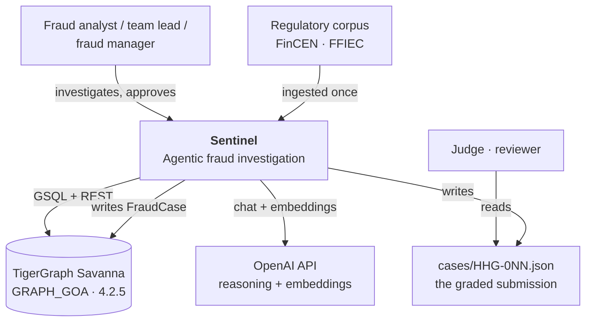
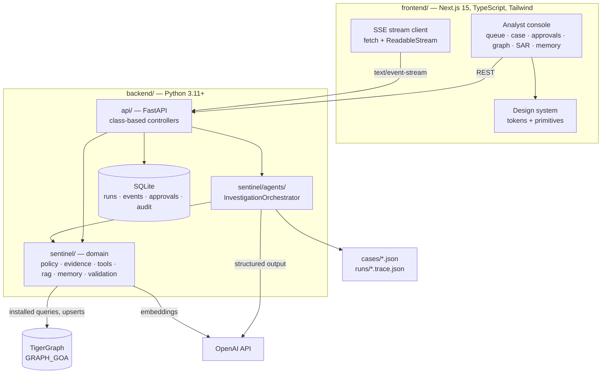
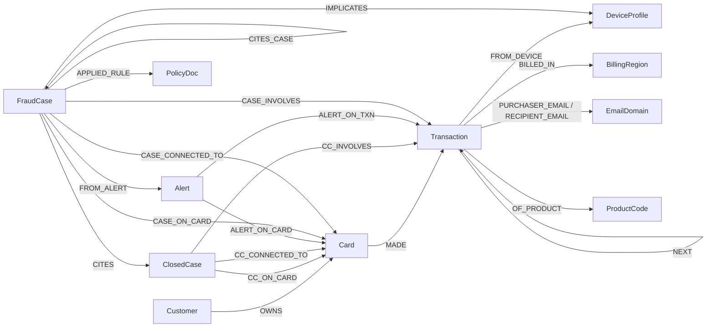
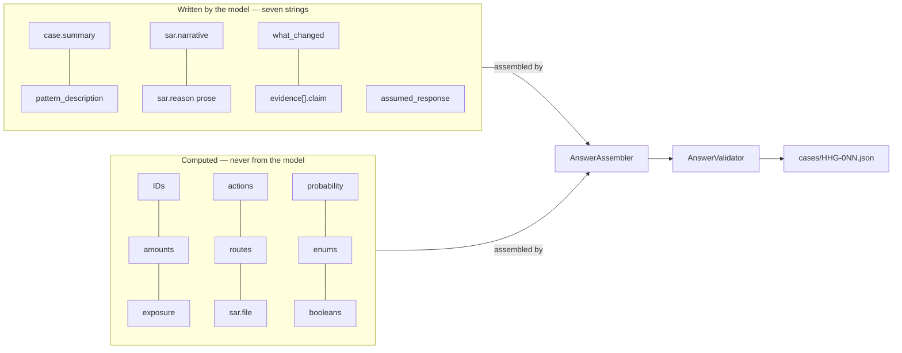
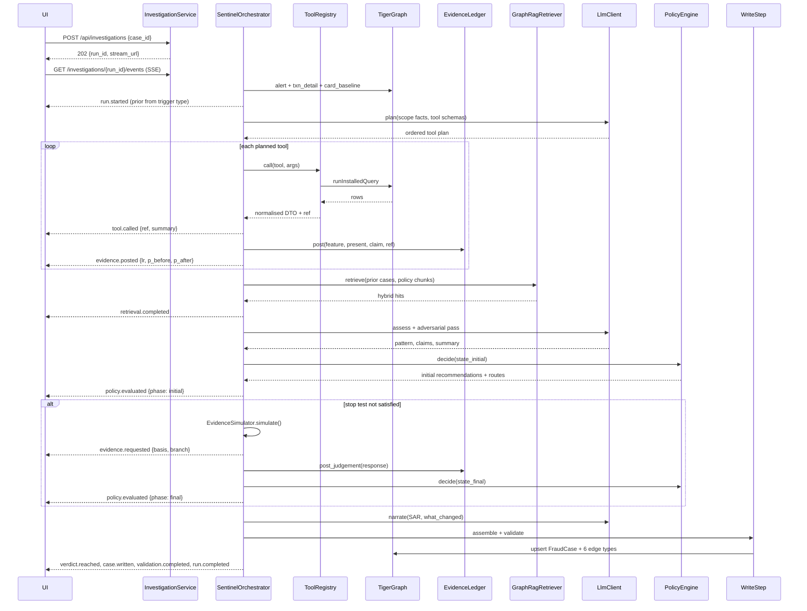
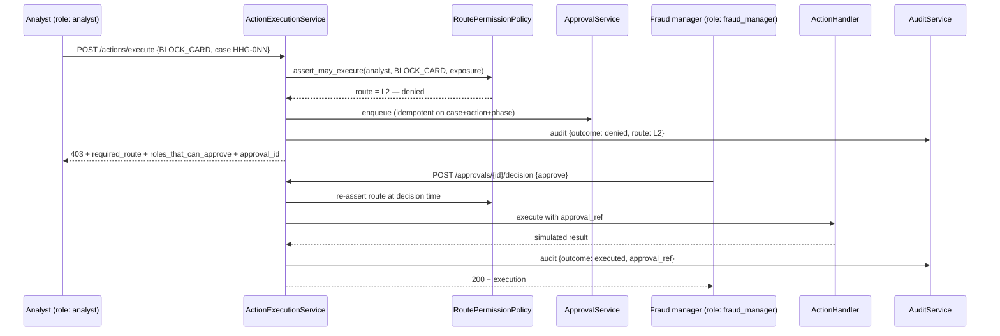

# Sentinel v2 — High-Level Design

The architecture of the system described in [PRD.md](PRD.md): its containers, its components and
their contracts, the flows that cross them, and the decisions that produced this shape rather than
another. Class-level detail belongs in [LLD.md](LLD.md).

---

## Contents

1. [Architectural overview](#1-architectural-overview)
2. [Context and containers](#2-context-and-containers)
3. [Components](#3-components)
4. [Data architecture](#4-data-architecture)
5. [Agent architecture](#5-agent-architecture)
6. [Flows](#6-flows)
7. [Cross-cutting concerns](#7-cross-cutting-concerns)
8. [Deployment](#8-deployment)
9. [Architecture decisions](#9-architecture-decisions)
10. [Quality attributes](#10-quality-attributes)

---

## 1. Architectural overview

Sentinel is a four-layer system with one rule running through it: **facts, belief and decisions are
produced by three different mechanisms, and only one of them is a language model.**

```
 Facts      ──  TigerGraph, reached through 16+ installed GSQL queries wrapped as typed tools
 Belief     ──  a log-odds ledger over likelihood ratios fitted on 5,565 closed cases
 Decisions  ──  a pure policy engine: R1–R10, 14 actions, the auto/L1/L2 routing table
 Prose      ──  an LLM, given retrieved context, writing seven named strings and nothing else
```

The orchestrator is a deterministic step pipeline that moves an investigation through those layers
and emits an event for everything it does. That event stream is simultaneously the UI's live
timeline, the audit trace, and — through the ledger postings it carries — the `evidence[]` array of
the answer file. One data structure, three deliverables.

## 2. Context and containers

### 2.1 Context



### 2.2 Containers



| Container | Technology | Responsibility |
|---|---|---|
| `frontend/` | Next.js 15 App Router, TypeScript strict, Tailwind, Radix, TanStack Query | The analyst console. Renders the queue, the live investigation, the action panel with routes, approvals, the case subgraph, the SAR and the memory view |
| `backend/api/` | FastAPI, Pydantic v2, SQLAlchemy 2.0 async + aiosqlite | HTTP surface, SSE streaming, action execution, the permission boundary, the audit trail |
| `backend/sentinel/` | Pure Python, no web framework | The domain: tools, evidence ledger, policy engine, GraphRAG, memory, validation, the orchestrator and its agents |
| TigerGraph | Savanna 4.2.5, `GRAPH_GOA` | Graph facts, closed-case memory, `FraudCase` write-back, embedding storage |
| SQLite | file-backed, `backend/var/sentinel.db` | Operational state only: runs, the event journal, executions, approvals, audit, idempotency |
| Filesystem | `cases/`, `runs/` | The submission artefact and the derived trace |

**Why SQLite exists at all.** The answer files are the deliverable and must stay byte-exact for
`eval/validate.py`. The audit trail and the event journal are operational and must survive a
restart — losing them mid-demo loses the permission-boundary beat. Two stores, two lifetimes, no
duplication of the graded artefact.

## 3. Components

### 3.1 Domain components (`backend/sentinel/`)

| Component | Responsibility | Key collaborators | Interface |
|---|---|---|---|
| `graph/GraphRepository` | The only door to TigerGraph: run an installed query, upsert a vertex, upsert an edge, fetch by id | `TokenManager`, `httpx.AsyncClient` | ABC with `TigerGraphRestRepository` and `FakeGraphRepository` |
| `graph/TokenManager` | Mint, cache and re-mint the Savanna bearer token; absorb the cold-start retry | `Settings` | `get_token()`, `invalidate()` |
| `tools/ToolRegistry` | The agent's tool surface: each installed query as a typed `GraphTool` with a JSON schema, argument validation, result normalisation and citation | `GraphRepository`, `QueryLog`, `EvidenceRef` | `describe()` for the model, `call(name, args)` for execution |
| `tools/QueryLog` | One per investigation. Ordered record of every tool call with its `ref`, entity ids and elapsed time | — | Produces `tool_calls` and the latency contribution |
| `evidence/EvidenceLedger` | Log-odds accumulation with group capping; the posting trail | `EvidenceLikelihoodTable` | `post()`, `post_judgement()`, `p`, `trajectory`, `independent_support()`, `evidence()` |
| `evidence/FeatureExtractor` | Turn normalised tool results into ledger postings — the only place that decides *which* feature a fact is | `EvidenceLedger`, tool DTOs | `extract(result) -> list[PostingRequest]` |
| `policy/PolicyEngine` | R1–R10 as a pure function of `CaseState` → ordered recommendations | `RoutingTable`, `SarPolicy`, gate pipeline | `decide(state)` |
| `policy/RoutingTable` | The auto/L1/L2 table, including the $2,500 `BLOCK_CARD` boundary | — | `route_for(action, exposure)` |
| `policy/SarPolicy` | The §3a gate and its three conditions; produces `file` and `reason` as one object so they cannot disagree | — | `evaluate(state) -> SarDecision` |
| `policy/StoppingPolicy` | Policy §6 | `EvidenceLedger` | `should_stop(state, support)` |
| `rag/GraphRagRetriever` | Hybrid retrieval: vector shortlist fused with structural graph filters, then graph expansion | `EmbeddingService`, `VectorIndex`, `GraphRepository` | `retrieve(query, kind, filters, k)` |
| `rag/CorpusBuilder` | Build and embed the `PolicyDoc` corpus and the closed-case narratives; idempotent and resumable | `EmbeddingService`, `GraphRepository` | `ingest()` |
| `memory/CaseMemoryStore` | Write a finished case into the graph with its six edge types and its embedding; read cases back | `GraphRepository`, `EmbeddingService` | `write(request)`, `for_card(card_id)` |
| `simulation/EvidenceSimulator` | Choose the response branch for a requested evidence type from graph facts, with a stated basis | ledger state, tool DTOs | `simulate(request, context) -> SimulatedResponse` |
| `validation/AnswerValidator` | The answer contract as code — pure, no network | shared enums | `validate(answer) -> ValidationReport` |
| `validation/GraphIdentityChecker` | Every id exists; exposure arithmetic; `FraudCase` existence | `GraphRepository` | `check(answer)` |
| `agents/*` | The step pipeline and the four LLM-bearing agents | everything above | `InvestigationOrchestrator.run(alert)` |
| `llm/LlmClient` | Provider-abstracted OpenAI access with structured output, retries and usage accounting | `Settings`, `CostMeter` | `complete(prompt, schema)` |

### 3.2 API components (`backend/api/`)

| Component | Responsibility |
|---|---|
| `Container` | Composition root. Builds every singleton once and hands them to controllers through `Depends` |
| `RouterController` (ABC) | Class-based controllers; one resource each, no I/O of their own |
| `EventJournal` | Persist-then-publish. Every event is written with a monotonic per-run `seq` before any subscriber sees it |
| `SseBroker` | Fan-out with bounded per-subscriber queues; a slow subscriber is dropped and told to reconnect |
| `JournalingEventEmitter` | The orchestrator's only output channel; owns the `StepCounter` that also fills `asked_after_step` |
| `RoutePermissionPolicy` | Authorization over the auto/L1/L2 table; raises a 403 that names the approving role |
| `ActionExecutionService` | The single door to every side effect, so the audit log cannot have holes |
| `ApprovalService` | The pending → approved → executed lifecycle, re-asserting the route at decision time |
| `BenchmarkService` | Runs the 20 cases in chronological order; produces the verdict mix, block rate and probability histogram |

### 3.3 Frontend components

Detailed in [frontend/DESIGN_SYSTEM.md](../../frontend/DESIGN_SYSTEM.md) and [LLD.md §7](LLD.md#7-frontend-design).
Shape: an app shell, six routes, a generated contract module that mirrors the backend enums, a
class-based `InvestigationStream` controller over `fetch` + `ReadableStream`, TanStack Query for
everything else, and a fixture mode that renders the whole case view with no backend at all.

## 4. Data architecture

### 4.1 Where each thing lives

| Data | Home | Lifetime | Why |
|---|---|---|---|
| Transactions, cards, customers, devices, regions, closed cases, alerts | TigerGraph | Permanent | Loaded and verified; the source of every fact |
| `FraudCase` + its 6 edge types | TigerGraph | Permanent | The brief requires cases written to the graph; it is the relationship index |
| `PolicyDoc` + `emb`, `ClosedCase.emb`, `FraudCase.emb` | TigerGraph | Permanent | Keeps the vector store *inside* the graph, which is what the brief asks for |
| Vector shortlist cache | Backend process memory (numpy) | Process | The hot path should not pay REST for 5,565 × 256 doubles on every query |
| The answer file | `cases/HHG-0NN.json` | Permanent, graded | It *is* the deliverable; a second copy invites drift |
| The trace (trajectory, postings, steps) | `runs/HHG-0NN.trace.json` + SQLite journal | Run-scoped | The answer format has exactly 9 top-level keys and `trajectory` is not one of them |
| Runs, executions, approvals, audit, idempotency | SQLite | Permanent locally | Must survive restart; the audit trail is itself a demo artefact |

### 4.2 The graph model

12 vertex types, 20 directed edges each with a materialised reverse — so traversal direction is
free. Full attribute detail is in [graph/schema.gsql](../../graph/schema.gsql) and catalogued in
[LLD.md §3](LLD.md#3-tool-and-repository-layer).



Three structural facts drive design decisions elsewhere:

- **`DeviceProfile` is a fingerprint class, not a device.** 116 profiles (1.2 %) carry 24,653 of the
  card links; the largest spans 842 cards. Every device-based connection must be gated on
  `n_cards`, or R6 fabricates a shared origin on nearly any card ever used online — and R6 implies
  `FILE_REPORT`.
- **576,425 `NEXT` edges are loaded and no query traverses them.** They are the cheapest unused
  asset in the graph and the basis for the two velocity features that currently have no tool.
- **`APPLIED_RULE` has 0 instances because `PolicyDoc` has 0 rows.** Filling the corpus is what
  turns policy citation from a string into a graph edge.

### 4.3 The evidence pipeline

```
GSQL query → normalised DTO → FeatureExtractor → PostingRequest → EvidenceLedger.post()
                                                                        │
                                          ┌─────────────────────────────┼──────────────────────┐
                                          ▼                             ▼                      ▼
                                 answer.case.evidence[]        probability trajectory     SSE evidence.posted
```

A posting carries its claim, its `ref`, its `entity_ids`, its likelihood ratio and the probability
before and after. That single record satisfies the answer file's evidence contract, the UI's
sparkline and the audit trace without being transformed three times.

## 5. Agent architecture

### 5.1 The decomposition, and why

A single agent with sixteen tools would work and would be unscoreable: no step boundaries, no
numbered steps for `asked_after_step`, no place to enforce a budget, and one prompt responsible for
both naming a pattern and choosing a route.

Sentinel splits the investigation into **ten steps**, of which **four are LLM-bearing agents** and
six are deterministic. The step names are a fixed contract — they appear in the SSE stream, the UI
timeline and the trace.

| # | Step | Class | LLM | Responsibility | Failure mode |
|---|---|---|---|---|---|
| 1 | `scope` | `ScopeStep` | no | Resolve alert → transaction → card → customer; set the ledger prior from trigger type; anchor every window on `Transaction.ts` | Alert or transaction missing → run fails fast |
| 2 | `plan` | `PlannerAgent` | **yes** | Choose which detectors to run and in what order, given trigger type and scope facts. Structured output constrained to the registry's tool schemas | Falls back to a static plan per trigger type |
| 3 | `sweep` | `SweepStep` | no | Execute the plan concurrently, normalise results, hand them to `FeatureExtractor`, post to the ledger | A failed tool posts nothing and is recorded as `ok: false` |
| 4 | `recall` | `RecallStep` | no | Hybrid retrieval of prior closed cases, Sentinel's own earlier cases, and policy/typology chunks; post base-rate evidence | Degrades to structural-only retrieval if the vector index is unavailable |
| 5 | `assess` | `AssessmentAgent` + `DevilsAdvocateAgent` | **yes** | Name the pattern from the 7 permitted values, write evidence claims, write the summary; then a second, adversarial pass that argues the legitimate reading and posts what it finds | Pattern falls back to `none`; claims fall back to templated text |
| 6 | `stop_test` | `StoppingStep` | no | Policy §6 against the ledger's independent support | — |
| 7 | `request_evidence` | `EvidenceRequestStep` | mixed | Choose the request type deterministically; the simulator picks the branch from graph facts; the LLM writes only the `assumed_response` prose from the stated basis | Skipped when the stop test already fired |
| 8 | `decide` | `DecisionStep` | no | `PolicyEngine.decide()` — once for `initial`, once for `final` | — |
| 9 | `narrate` | `NarrationAgent` | **yes** | SAR narrative grounded in the retrieved FinCEN standard, `what_changed`, `stop_reason` prose | Templated fallbacks; a missing narrative fails validation loudly rather than shipping empty |
| 10 | `write` | `WriteStep` | no | Assemble the answer, validate, write `cases/*.json`, write the `FraudCase` and its edges, embed | Invalid answers go to `runs/*.invalid.json`, never to `cases/` |

**The adversarial pass is deliberate.** Roughly half the benchmark is legitimate and the documented
failure mode is over-blocking. `DevilsAdvocateAgent` is prompted to make the strongest case that
the activity is legitimate, and may only post evidence that a tool actually supports — its
influence is bounded by the same group cap as everything else.

### 5.2 What is deliberately *not* an agent

| Candidate | Why it is code |
|---|---|
| Routing | A prompt will eventually emit `auto` for `BLOCK_CARD`. 25 % of the score is action quality |
| Episode scoping / exposure | Exposure determines the `BLOCK_CARD` route and the SAR threshold. One hallucinated transaction flips both |
| The SAR filing decision | §3a is a gate over an OR. It is four boolean reads |
| The stopping test | Policy §6 is two comparisons and a count |
| The simulated response *branch* | If the model picks the branch, it picks the conclusion, and the whole initial→final story becomes circular |

### 5.3 The LLM boundary



The boundary is structural: `AnswerAssembler` takes typed values from the policy engine, the ledger
and the tool DTOs, and takes prose through a separate `Narration` object whose fields are all
`str`. There is no code path by which a model response becomes an action name.

## 6. Flows

### 6.1 One investigation



### 6.2 The permission boundary



### 6.3 The benchmark run

Cases are ordered by `Alert.opened_at` ascending, so the earliest alert (HHG-017, 2016-11-12) runs
first and the latest (HHG-004 and HHG-011, 2016-12-29) run last. Each case's `FraudCase` is written
before the next begins. Concurrency is bounded (default 4) but ordering is preserved at the
write-back barrier, so a later case can retrieve an earlier Sentinel case without a race.

## 7. Cross-cutting concerns

| Concern | Approach |
|---|---|
| **Configuration** | One `Settings` class (pydantic-settings) reading `.env`. Nothing else calls `os.getenv`. `OPENAI_MODEL` and `OPENAI_EMBEDDING_MODEL` have **no defaults** — a hard-coded model id is how an hour is lost to a 404 |
| **Secrets** | `TG_SECRET` and `OPENAI_API_KEY` stay in the backend process. The frontend receives exactly one variable, `NEXT_PUBLIC_API_BASE_URL`, because Next.js inlines every `NEXT_PUBLIC_*` into the client bundle |
| **Logging** | Structured JSON with a request id and a run id in a contextvar; one access-log line per request; every tool call and every LLM call logged with elapsed time and cost |
| **Error handling** | A `SentinelError` hierarchy mapped to `application/problem+json`. Graph errors distinguish *not found* from *lookup failed* — the current validator conflates them, so a transient auth failure reads as an invalid answer file |
| **Retries** | Graph calls: 3 attempts with exponential backoff, plus a longer first-call timeout for the cold workspace. LLM calls: 3 attempts, and a structured-output mismatch is a retry with the validation error fed back |
| **Budgets** | `BudgetGuard` enforces 25 tool calls, exactly 1 evidence round, a token ceiling, a USD ceiling and a wall-clock ceiling per run. Exceeding any one ends the run as `budget_exceeded`, not silently |
| **Determinism** | Temperature 0 and a fixed seed for every structured call; the policy path has no model in it at all |
| **Observability** | Every run's event journal is persisted, so any run is replayable at any speed. This doubles as demo insurance |
| **Security** | Authorization is real and unit-tested; authentication is a header and documented as demo-grade. No GSQL string interpolation — the one existing instance (`_device_key_for_label`) is deleted in the refactor |

## 8. Deployment

### 8.1 Local development

```
┌─ localhost:3000 ── Next.js dev server ─┐        ┌─ localhost:8000 ── uvicorn ─┐
│  NEXT_PUBLIC_API_BASE_URL ─────────────┼───────▶│  FastAPI + orchestrator      │
└────────────────────────────────────────┘        │  SQLite: backend/var/*.db    │
                                                   └──────┬───────────────┬──────┘
                                                          │ HTTPS :443    │ HTTPS
                                                   ┌──────▼──────┐  ┌─────▼──────┐
                                                   │ TigerGraph   │  │ OpenAI API │
                                                   │ Savanna      │  └────────────┘
                                                   └──────────────┘
```

Savanna terminates both REST++ and GSQL on port 443. The workspace auto-stops when idle and takes
about 45 seconds to wake; the first call after idle returns an HTML "Starting workspace" page rather
than JSON, which the repository detects explicitly and retries rather than reporting as an error.

### 8.2 Demo topology

The demo runs against the same stack but drives the UI from `ReplayOrchestrator` over a recorded
journal. Nothing in the recorded path calls OpenAI or waits on a cold workspace, so the video has no
dead air and no dependency on a live model.

## 9. Architecture decisions

### ADR-1 — A custom class-based orchestrator, not a framework

**Context.** [BUILD_PLAN.md](../BUILD_PLAN.md) Step 7 specified LangGraph. The product owner
requires class-based code, and 25 % of the score is action quality that must be deterministic.

**Decision.** Implement `InvestigationOrchestrator` as an ABC with a concrete `SentinelOrchestrator`
that runs an ordered list of `InvestigationStep` objects over a shared `InvestigationContext`.

**Consequences.** Full control of step numbering (which `asked_after_step` requires), of budget
enforcement, and of the event emission order the frontend codes against. No framework upgrade can
change control flow. Cost: we write the retry, the cancellation and the streaming ourselves —
roughly 300 lines that would otherwise be free.

**Rejected.** LangGraph (function-first, and its checkpointing solves a problem we do not have).
OpenAI Agents SDK (handoffs are elegant, but the deterministic policy path is the thing being
scored and it would sit outside the framework anyway).

### ADR-2 — The API depends on an orchestrator ABC, never on the agent

**Decision.** Three implementations: `ScriptedOrchestrator` (replays a fixture journal, available
on day one), `SentinelOrchestrator` (the real agent), `ReplayOrchestrator` (replays a recorded run).

**Consequences.** The frontend track starts immediately and never blocks on the agent track. The
demo can be recorded from a journal. Swapping is one line in the composition root.

### ADR-3 — Vectors live in TigerGraph; the hot path reads a process-local cache

**Context.** `emb LIST<DOUBLE>` accepts and returns doubles correctly (verified by direct REST
upsert), but it is **not** a native vector attribute: `GET /restpp/vector/status/...` returns
`REST-0004` on all three types, so `vectorSearch()` and HNSW are unavailable without a schema
migration on a live 590,742-vertex graph.

**Decision.** Store every embedding on the graph vertices — the brief asks for TigerGraph vector
storage and a judge should see it there. Compute the shortlist client-side over a cached numpy
matrix, then expand the shortlist **through the graph** with structural queries.

**Consequences.** Retrieval is fast and carries no migration risk, and it is genuinely hybrid
rather than a vector database bolted to a graph. Cost: the cache must be warmed at startup
(5,565 × 256 float32 ≈ 5.7 MB, trivial).

**Rejected.** GSQL cosine over `LIST<DOUBLE>` (plausible for ~50 PolicyDoc rows, unproven at 5,565
and needing a 4-minute install cycle to test). Native vector attributes (a schema migration on a
live graph, during a hackathon).

### ADR-4 — Embeddings at 256 dimensions

5,565 closed cases at 1,536 dimensions is roughly 130 MB of JSON over REST upsert. OpenAI's
`dimensions` parameter at 256 cuts that to about 25 MB, batched a couple of hundred vertices per
POST. The dimension is recorded as a `MetaDoc` row so nothing downstream has to guess.

### ADR-5 — SSE over WebSocket

One-way, survives proxies, `curl`-able live in the demo, and `Last-Event-ID` gives replay as a
protocol feature. The journal is written **before** publish, so a subscriber can never be ahead of
it and reconnection is an exact `WHERE seq > ?`.

**Named trap:** the browser's native `EventSource` cannot send custom headers, so it can carry
neither the role header nor `Last-Event-ID` on a first connect, and it reconnects forever past a
terminal event. The frontend uses `fetch` + `ReadableStream`; the API also accepts `?role=` and
`?last_event_id=` as query fallbacks.

### ADR-6 — Routes are recomputed, never echoed

`route_for(action, exposure)` is called on every read and every execute. A client cannot downgrade
`BLOCK_CARD` to `auto`, and an answer file whose route drifted is detected and badged rather than
silently obeyed. The existing `policy._enforce_gates` already does this internally; the API applies
the same discipline at its own boundary.

### ADR-7 — One contract, generated into TypeScript

The 14 action names, three routes and seven enums are currently duplicated between `policy.py` and
`validate.py`, and a third copy would appear in the frontend. `GET /api/meta` serves them from
`sentinel.policy`, and a CLI emits `frontend/src/lib/generated/contract.ts` from the same source.
The frontend never hand-types `"BLOCK_ALL_CARDS"`.

### ADR-8 — The answer file is the only submission artefact

No database copy, no extra keys. The trajectory, the postings and the step trace — which the UI
needs and the answer format does not define — live in `runs/HHG-0NN.trace.json` and the event
journal.

### ADR-9 — Async graph repository over `httpx`, not sync pyTigerGraph

A case makes roughly 15 graph calls at 0.7–1.1 s each. Serially that is 10–16 s of pure latency per
case and about five minutes across the benchmark. An async repository overlaps the independent ones
and keeps a running investigation from blocking every other request. pyTigerGraph remains in the
one-shot loader scripts, which are already written and already run.

## 10. Quality attributes

| Attribute | How the architecture achieves it | How it is verified |
|---|---|---|
| **Correctness of decisions** | The policy path contains no model; routes are recomputed; gates run after the rules | 40 unit tests, one per rule plus negatives |
| **Calibration** | Likelihood ratios fitted case-control on 5,565 closed cases; group caps; `lr_absent` | Reliability check on the fitted risk bands; benchmark histogram |
| **Explainability** | One posting record serves evidence, trajectory and timeline; every claim carries a re-runnable `ref` | Validator checks evidence shape; refs are generated by one value object |
| **Auditability** | Single execution door; every attempt writes a row including denials | Audit contract test |
| **Resilience** | Cold-start detection and retry, budget guards, invalid answers quarantined, journal replay | Integration tests with a `FakeGraphRepository`; a forced-cold-start test |
| **Testability** | Every collaborator behind an ABC; `FakeGraphRepository` needs no network | Unit suites run with no credentials |
| **Performance** | Concurrent independent graph calls; cached vector shortlist; bounded SSE queues | Per-case latency recorded in `latency_s` on every answer |
| **Accessibility** | Tokens carry measured contrast; keyboard model specified per screen; `aria-live` on the stream | Design-system contrast table; axe pass on the three main routes |
