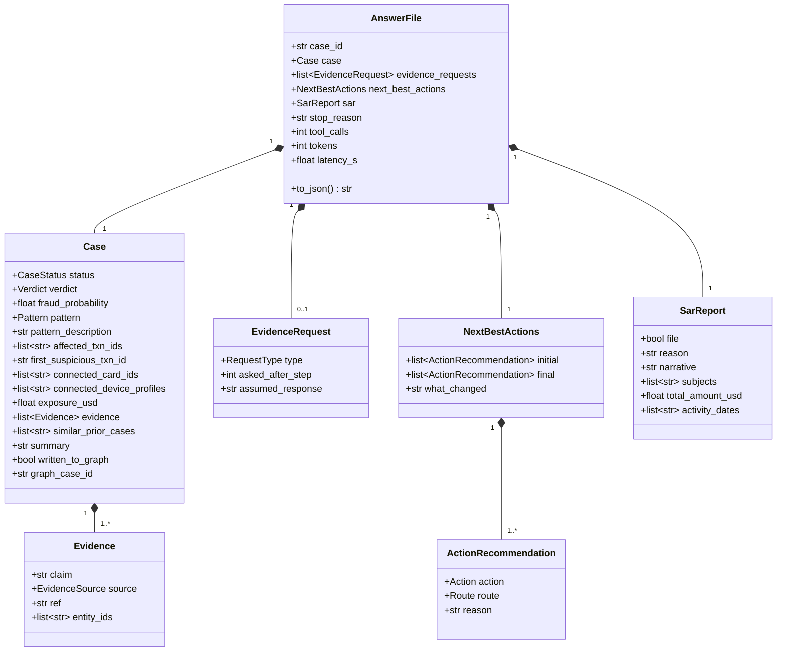
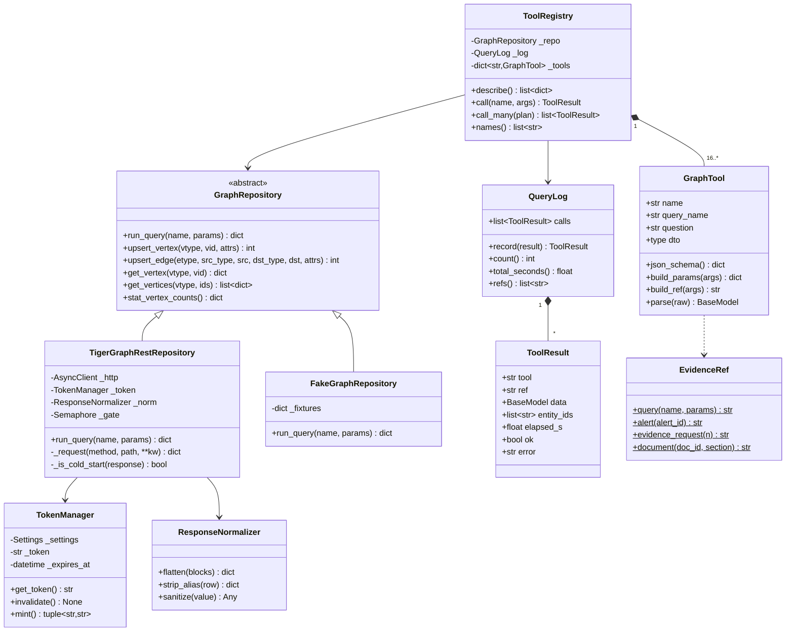
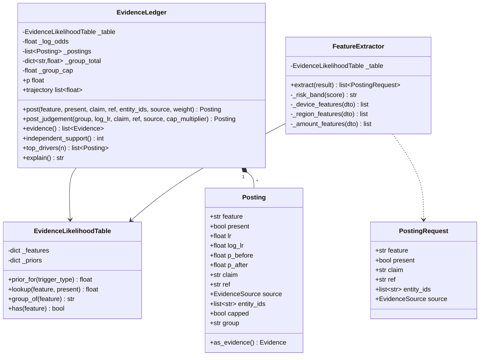
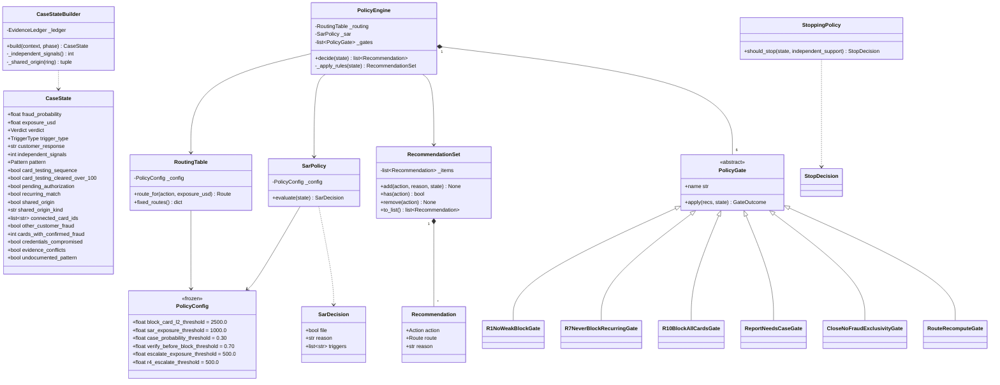
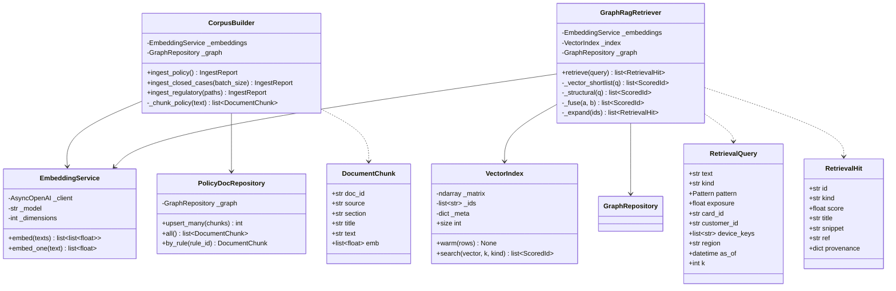
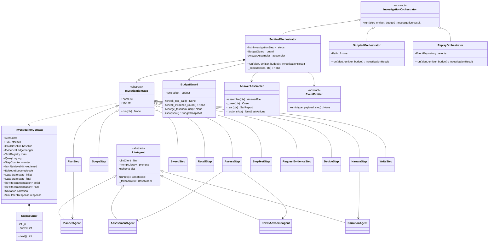
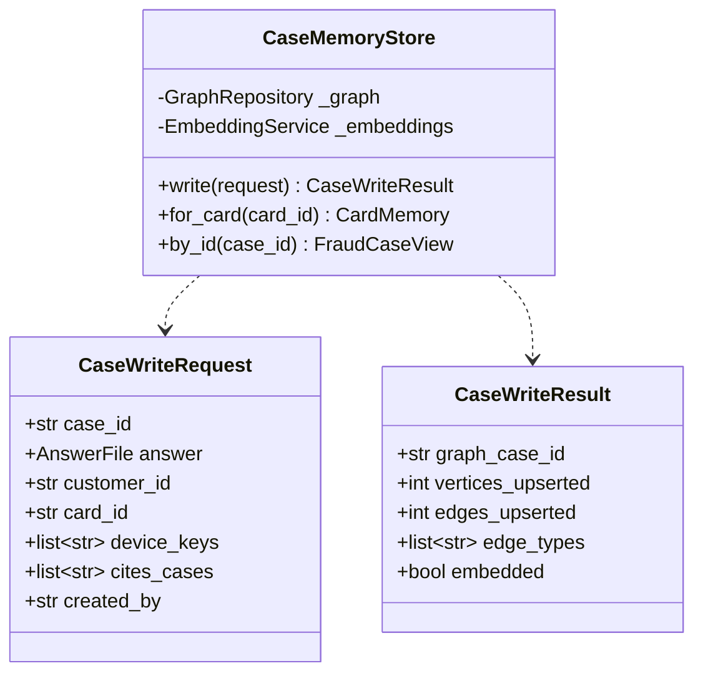
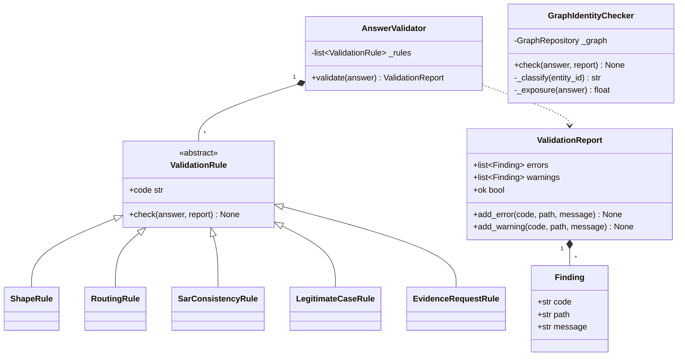
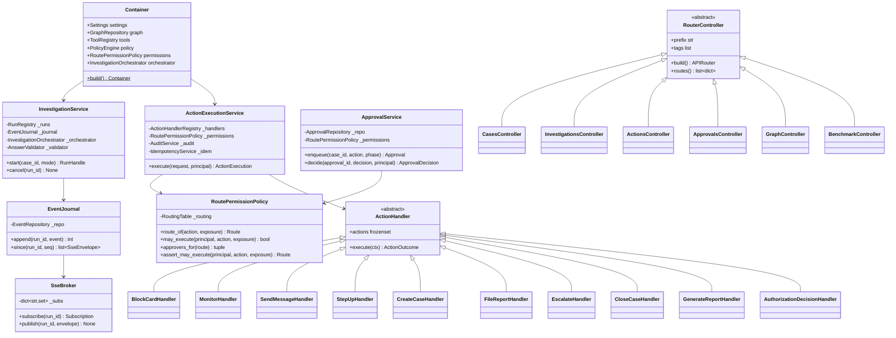
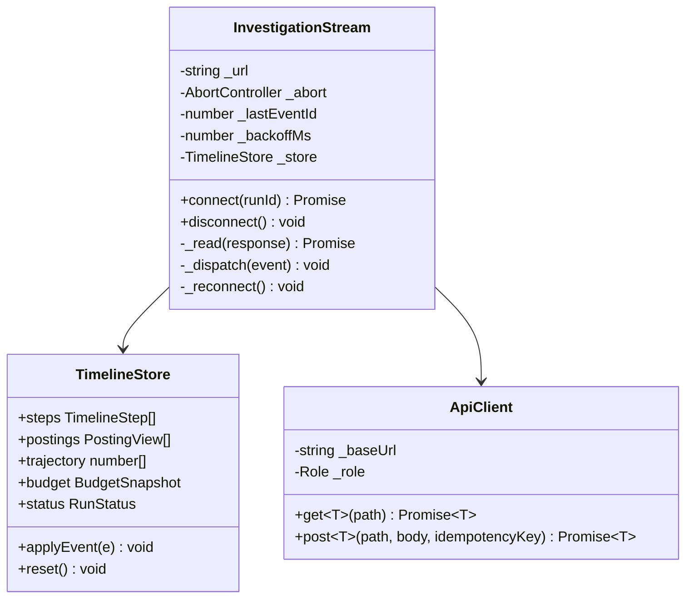

# Sentinel v2 — Low-Level Design

The implementation specification. An engineer builds from this document without making
architectural decisions; the architecture is settled in [HLD.md](HLD.md) and the product in
[PRD.md](PRD.md).

Every class named in a diagram appears in the prose, and every class in the prose appears in a
diagram. Names, signatures, field names, rule ids and query names are taken from the real repository
— where a name is new, it is marked **new**.

---

## Contents

1. [Package layout](#1-package-layout)
2. [Domain model](#2-domain-model)
3. [Tool and repository layer](#3-tool-and-repository-layer)
4. [Evidence ledger](#4-evidence-ledger)
5. [Policy engine](#5-policy-engine)
6. [GraphRAG](#6-graphrag)
7. [Agents and orchestration](#7-agents-and-orchestration)
8. [Memory and write-back](#8-memory-and-write-back)
9. [Validation](#9-validation)
10. [API layer](#10-api-layer)
11. [Frontend design](#11-frontend-design)
12. [Key data structures](#12-key-data-structures)
13. [Algorithms](#13-algorithms)
14. [Error taxonomy and retries](#14-error-taxonomy-and-retries)
15. [Test matrix](#15-test-matrix)

---

## 1. Package layout

```
backend/
  pyproject.toml                     # the repo has no dependency manifest today — this is task B1
  var/sentinel.db                    # SQLite, gitignored
  sentinel/                          # the domain package; no web framework imports
    config/settings.py               Settings
    domain/
      enums.py                       Action, Route, Role, Verdict, CaseStatus, Pattern,
                                     EvidenceSource, RequestType, TriggerType
      answer.py                      AnswerFile, Case, Evidence, EvidenceRequest,
                                     NextBestActions, ActionRecommendation, SarReport
      alert.py                       Alert, TriggerContext
      trace.py                       InvestigationTrace, TraceStep, PostingView
      errors.py                      SentinelError hierarchy
    graph/
      repository.py                  GraphRepository (ABC)
      tigergraph.py                  TigerGraphRestRepository
      fake.py                        FakeGraphRepository
      token.py                       TokenManager
      normalize.py                   ResponseNormalizer, NumericSanitizer
    tools/
      registry.py                    ToolRegistry, GraphTool
      dto.py                         TxnDetail, CardBaseline, RegionNovelty, ... (16 DTOs)
      log.py                         QueryLog, ToolResult
      refs.py                        EvidenceRef
    evidence/
      elt.json                       moved verbatim from sentinel/elt.json
      table.py                       EvidenceLikelihoodTable
      ledger.py                      EvidenceLedger, Posting
      extractor.py                   FeatureExtractor
    policy/
      actions.py                     Action re-export, ACTION_ORDER
      routing.py                     RoutingTable
      state.py                       CaseState, CaseStateBuilder
      engine.py                      PolicyEngine, Recommendation, RecommendationSet
      sar.py                         SarPolicy, SarDecision
      stopping.py                    StoppingPolicy, StopDecision
      gates/                         PolicyGate (ABC) + 6 concrete gates
      config.py                      PolicyConfig (the six thresholds)
    rag/
      corpus.py                      CorpusBuilder, DocumentChunk
      embeddings.py                  EmbeddingService
      index.py                       VectorIndex
      retriever.py                   GraphRagRetriever, RetrievalHit, RetrievalQuery
      policydoc.py                   PolicyDocRepository
    simulation/
      simulator.py                   EvidenceSimulator, SimulatedResponse
    memory/
      store.py                       CaseMemoryStore, CaseWriteRequest, CaseWriteResult
    validation/
      validator.py                   AnswerValidator, ValidationReport, Finding
      rules.py                       ShapeRule, RoutingRule, SarConsistencyRule,
                                     LegitimateCaseRule, EvidenceRequestRule
      graph_check.py                 GraphIdentityChecker
    llm/
      client.py                      LlmClient, LlmResponse, CostMeter
      prompts.py                     PromptLibrary, PromptTemplate
    agents/
      orchestrator.py                InvestigationOrchestrator (ABC), SentinelOrchestrator
      scripted.py                    ScriptedOrchestrator, ReplayOrchestrator
      context.py                     InvestigationContext, StepCounter
      steps/                         InvestigationStep (ABC) + 10 concrete steps
      agents/                        PlannerAgent, AssessmentAgent, DevilsAdvocateAgent,
                                     NarrationAgent
      assembler.py                   AnswerAssembler, Narration
      budget.py                      RunBudget, BudgetGuard
      emitter.py                     EventEmitter (ABC)
  api/                               (see §10)
  tests/
    unit/ integration/ contract/ live/
frontend/                            (see §11)
```

The six `sys.path.insert(...)` lines in the current scripts disappear: `backend/` is installed with
`pip install -e backend/`.

---

## 2. Domain model

### 2.1 Enums

Single source of truth. `validation/` and the TypeScript contract are both generated from these —
today the 14 action names exist twice, in `sentinel/policy.py` and `eval/validate.py`.

```python
class Action(str, Enum):
    ALLOW_TRANSACTION = "ALLOW_TRANSACTION"
    DECLINE_TRANSACTION = "DECLINE_TRANSACTION"
    MONITOR_CARD = "MONITOR_CARD"
    MONITOR_CONNECTED_CARDS = "MONITOR_CONNECTED_CARDS"
    WARN_CUSTOMER = "WARN_CUSTOMER"
    VERIFY_WITH_CUSTOMER = "VERIFY_WITH_CUSTOMER"
    STEP_UP_AUTH = "STEP_UP_AUTH"
    BLOCK_CARD = "BLOCK_CARD"
    BLOCK_ALL_CARDS = "BLOCK_ALL_CARDS"
    GENERATE_REPORT = "GENERATE_REPORT"
    CREATE_CASE = "CREATE_CASE"
    FILE_REPORT = "FILE_REPORT"
    ESCALATE_TO_ANALYST = "ESCALATE_TO_ANALYST"
    CLOSE_NO_FRAUD = "CLOSE_NO_FRAUD"

class Route(str, Enum):      AUTO = "auto"; L1 = "L1"; L2 = "L2"
class Role(str, Enum):       ANALYST = "analyst"; TEAM_LEAD = "team_lead"; FRAUD_MANAGER = "fraud_manager"
class Verdict(str, Enum):    FRAUD = "fraud"; LEGITIMATE = "legitimate"; UNCERTAIN = "uncertain"
class CaseStatus(str, Enum): OPEN = "open"; CLOSED_FRAUD = "closed_fraud"
                             CLOSED_LEGITIMATE = "closed_legitimate"; ESCALATED = "escalated"
class Pattern(str, Enum):    CARD_TESTING = "card_testing"
                             CARD_NOT_PRESENT_FRAUD = "card_not_present_fraud"
                             CARD_NOT_PRESENT_NEW_DEVICE = "card_not_present_new_device"
                             OUT_OF_REGION_USE = "out_of_region_use"
                             ACCOUNT_TAKEOVER = "account_takeover"
                             UNDOCUMENTED = "undocumented"; NONE = "none"
class EvidenceSource(str, Enum): GRAPH = "graph"; DOCUMENT = "document"
                                 CUSTOMER = "customer"; EXTERNAL = "external"
class RequestType(str, Enum):    CUSTOMER_VALIDATION = "customer_validation"
                                 STEP_UP_AUTH = "step_up_auth"; ANALYST_INFO = "analyst_info"
class TriggerType(str, Enum):    RISK_SCORE = "risk_score"; CUSTOMER_REPORT = "customer_report"
                                 ANALYST_REQUEST = "analyst_request"
```

### 2.2 The answer contract



**Field counts are contractual**: 9 top level, 15 in `case`, 3 in `evidence_requests[]`, 3 in
`next_best_actions`, 6 in `sar`, 4 in `evidence[]`, 3 in `next_best_actions.*[]`. *Missing fields
score zero for that part.*

Model validators on `AnswerFile` (these mirror the hard invariants and run before any file is
written):

| Validator | Rule |
|---|---|
| `sar_agrees_with_actions` | `sar.file == (Action.FILE_REPORT in {r.action for r in next_best_actions.final})` |
| `sar_empty_when_not_filing` | `file is False` ⇒ `narrative == ""`, `subjects == []`, `total_amount_usd == 0`, `activity_dates == []` |
| `sar_complete_when_filing` | `file is True` ⇒ narrative non-empty and 6–12 sentences, `subjects` non-empty, `len(activity_dates) == 2` |
| `legitimate_is_clean` | `verdict is LEGITIMATE` ⇒ `affected_txn_ids == []`, `exposure_usd == 0`, `sar.file is False` |
| `undocumented_has_description` | `pattern is UNDOCUMENTED` ⇔ `pattern_description != ""` |
| `final_equals_initial_without_requests` | `evidence_requests == []` ⇒ `final == initial` (deep equality including `reason` strings) |
| `first_suspicious_in_affected` | `first_suspicious_txn_id`, when non-empty, ∈ `affected_txn_ids` |
| `written_to_graph_has_id` | `written_to_graph` ⇒ `graph_case_id != ""` |
| `probability_in_range` | `0.0 <= fraud_probability <= 1.0` |
| `evidence_non_empty` | `len(evidence) >= 1` |

`exposure_usd == sum(abs(amt))` and id existence need the graph and therefore live in
`GraphIdentityChecker` (§9), not in the model.

---

## 3. Tool and repository layer



### 3.1 `GraphRepository`

The entire repository surface the current code needs is four operations — `run_query`,
`upsert_vertex`, `upsert_edge`, `get_vertex` — because that is every TigerGraph call site in the
repo today (`tools.py:85`, `memory.py:27,52-64,79`, `validate.py:209,219,228`,
`write_cases_to_graph.py:23`).

```python
class GraphRepository(ABC):
    """The only door to TigerGraph.

    Responsibility: transport, authentication, retry and normalisation. It knows
    nothing about fraud, evidence or policy.
    Collaborators: TokenManager, ResponseNormalizer.
    """

    @abstractmethod
    async def run_query(self, name: str, params: Mapping[str, Any]) -> dict[str, Any]: ...

    @abstractmethod
    async def upsert_vertex(self, vtype: str, vid: str, attrs: Mapping[str, Any]) -> int: ...

    @abstractmethod
    async def upsert_edge(self, etype: str, src_type: str, src: str,
                          dst_type: str, dst: str,
                          attrs: Mapping[str, Any] | None = None) -> int: ...

    @abstractmethod
    async def get_vertex(self, vtype: str, vid: str) -> dict[str, Any] | None: ...
```

`TigerGraphRestRepository` talks plain REST over `httpx.AsyncClient`:

```
GET  {host}/restpp/query/{graph}/{name}?param=value     Authorization: Bearer {token}
GET  {host}/restpp/graph/{graph}/vertices/{type}/{id}
POST {host}/restpp/graph/{graph}                        (upsert vertices + edges)
POST {host}/restpp/builtins/{graph}                     {"function":"stat_vertex_number","type":"*"}
```

Three behaviours are non-negotiable:

1. **Cold-start detection.** When a response body starts with `<html` and contains
   `Starting workspace`, the workspace is waking. `_is_cold_start` returns true, and the caller
   retries with backoff up to `tg_connect_retries` with an extended timeout. Measured wake time
   this session: **45 s**. It is not an error and must never surface as one.
2. **Token invalidation.** A 401/403 calls `TokenManager.invalidate()` and retries once. Tokens
   expire; the current one on 2026-09-27.
3. **Concurrency gate.** An `asyncio.Semaphore(settings.tg_max_concurrency)` (default 8) so a
   benchmark batch cannot flood the workspace.

Over raw REST, `VERTEX<T>` parameters take a **bare id** (`c_in=C08623-K2`). The 1-tuple wrapping in
today's `tools.py` (`VERTEX_PARAMS = {"t_in","c_in","d_in","r_in","e_in"}`) is a pyTigerGraph quirk
and does not carry over.

### 3.2 `ResponseNormalizer` — four traps in one class

TigerGraph returns a list of single-key blocks; 12 of the 16 queries return alias-prefixed keys
(`T.txn_id`, `SIB.card_id`, `C2.@shared`, `CC.case_id`, `DALL.device_key`) and 4 return bare names.
Two sentinel values leak from empty accumulators.

```python
class ResponseNormalizer:
    NEG_INF = -1.797693134862316e+308
    EPOCH_SENTINEL = "1970-01-01 00:00:00"

    def flatten(self, blocks: list[dict]) -> dict[str, Any]:
        """Merge TigerGraph's list-of-single-key-blocks into one dict."""

    def strip_alias(self, row: Mapping[str, Any]) -> dict[str, Any]:
        """'T.txn_id' -> 'txn_id'; '@shared' kept as 'shared'."""

    def sanitize(self, value: Any) -> Any:
        """NEG_INF -> None, EPOCH_SENTINEL -> None, recursively."""
```

Without `sanitize`, `card_testing_probe.largest_purchase_after` renders as `-1.8e308` and
`region_novelty.first_seen_in_region` as `1970-01-01` — and an LLM will faithfully report that the
card was first seen in that region in 1970. A contract test asserts that no API response body
contains either sentinel.

### 3.3 The tool catalogue

All 16 are installed and were executed live during the survey. Latency is measured.

| Tool | GSQL params | Returns (normalised) | Investigative question | ms |
|---|---|---|---|---|
| `txn_detail` | `t_in` | `txn`, `device`, `card` | What was flagged, on what device, on whose card. **The only source of the true `ts`** | 910 |
| `card_baseline` | `c_in` | `card`, `customer`, `sibling_cards` | What is normal for this cardholder | 780 |
| `card_window` | `c_in, center, hours` | `window[]` ordered by ts | What else happened around the alert | 1050 |
| `card_testing_probe` | `c_in, center, small_amt` | `small_online_auths_1h/24h`, `small_txn_ids`, `largest_purchase_after`, `purchases_after_ids` | R5 | 770 |
| `region_novelty` | `c_in, region, as_of` | `prior_txns_in_region`, `total_txns_in_region`, `prior_txns_on_card`, `first_seen_in_region`, `last_in_region_before_alert`, `in_person_elsewhere_24h`, `other_regions_24h` | Is this region new *as of the alert*, and could they physically be there | 810 |
| `amount_band_probe` | `c_in, amt, tol, as_of` | `prior_charges_in_band`, `total_charges_in_band`, `prior_txns_on_card`, `card_amounts` | Is this amount ordinary for this card | 770 |
| `device_novelty` | `t_in` | `flags`, `prior_txns_this_device_on_card`, `prior_online_txns_on_card`, `prior_txns_on_card` | id_15 / id_23 / id_34, and has this card used this device | 860 |
| `device_neighbors` | `d_in, center, days` | `device`, `profile_spans_cards`, `txns_in_window`, `cards_on_device` | Who else used this fingerprint, and how specific is it | 710 |
| `region_cluster` | `r_in, win_from, win_to, base_from, base_to, risk_thresh` | `window_txns/high_risk`, `baseline_txns/high_risk`, `window_high_risk_cards/txns` | Is this region hot *against a matched baseline* | 810 |
| `email_cluster` | `e_in, center, days, risk_thresh` | `txns_in_window`, `high_risk_in_window`, `distinct_cards` | Recipient-domain fan-in | 800 |
| `ring_expand` | `c_in, center, days, max_device_cards` | `devices_used`, `identifying_devices`, `devices_total`, `devices_specific_enough`, `connected_cards` | R6 shared origin, gated | 790 |
| `recurring_charge_probe` | `c_in, amt, tol, product` | `matching_charges`, `distinct_months`, `months`, `regions`, `txn_ids` | R7 — is the disputed charge a subscription | 790 |
| `velocity_probe` | `c_in, center, hours` | `txns_in_window`, `online_in_window`, `total_amount`, `max_risk_in_window`, `distinct_regions`, `distinct_devices`, `regions` | Burst, geography, device churn | 770 |
| `customer_case_history` | `customer_id` | `cases[]`, `confirmed_fraud_cases`, `cleared_cases`, `customer_reports_confirmed_fraud`, `lifetime_exposure`, `patterns_seen` | This customer's denial track record | 780 |
| `similar_prior_cases` | `pattern_in, amt_lo, amt_hi, outcome_in, k` | `cases[]` | Structural retrieval over 5,565 closed cases | 790 |
| `case_memory_for_card` | `c_in` | `bank_closed_cases`, `sentinel_cases`, `cases_connecting_this_card` | Everything already known about this card — **the memory-compounds mechanism** | 760 |

**Known defects to carry forward as facts, not surprises:**

- `card_baseline.sibling_cards` **includes the seed card**. Filter `c_in` before reasoning about
  "other cards" and before any `BLOCK_ALL_CARDS` arithmetic.
- `similar_prior_cases` is `ORDER BY exposure_usd ASC LIMIT k` — it returns the *k cheapest* cases in
  the band, not the *k most similar*. This is precisely the hole GraphRAG fills.
- `email_cluster` keys on a **domain**, not an address: `gmail.com` at ±30 days returns 12,018
  transactions across 1,837 cards. Treat it as a base rate, never as a ring.
- `device_novelty.prior_txns_this_device_on_card == 0` on a transaction with `device_key == ""`
  means **not observable**, not *new device*. Seven of the 20 alerts have no device record.

### 3.4 New queries (task G1, one install pass)

Batch all of these into one file and one `INSTALL` — the existing 16 took 4 minutes to compile.

| Query | Signature | Why |
|---|---|---|
| `txn_sequence_context` | `(VERTEX<Transaction> t_in, INT back, INT fwd)` | Walks `PREV`/`NEXT` for `gap_seconds`. **576,425 NEXT edges are loaded and unused**; this feeds `burst_under_1h` and `burst_under_10m`, two fitted features with no tool |
| `product_novelty` | `(VERTEX<Card> c_in, STRING product, DATETIME as_of)` | Feeds `product_novel_for_card` (LR 2.297), currently unreachable |
| `card_amount_stats` | `(VERTEX<Card> c_in, DATETIME as_of)` | Prior mean and stddev before `as_of`; feeds `amt_above_prior_p95ish` and `amt_below_prior_mean` |
| `device_by_label` | `(STRING label)` | Replaces `memory._device_key_for_label`'s interpolated full scan |
| `alerts_queue` | `()` | All 20 alerts joined to any `FraudCase` via `ALERT_CASE`. The UI queue |
| `case_by_id` | `(VERTEX<FraudCase> f_in)` | The case plus its six edge sets |
| `case_subgraph` | `(VERTEX<FraudCase> f_in, INT max_nodes)` | Nodes and edges shaped for the graph canvas |
| `ring_expand_2hop` | `(VERTEX<Card> c_in, DATETIME center, INT days, INT max_device_cards, INT max_cards)` | Returns the **card-to-card edge list**, not a component. Components are computed client-side |
| `policy_docs_page` | `(INT skip, INT limit)` | Paged `PolicyDoc` fetch for the vector cache |
| `closed_case_embeddings_page` | `(INT skip, INT limit)` | Paged `ClosedCase` id + emb for the vector cache |

---

## 4. Evidence ledger



### 4.1 The fitted table

`elt.json` holds **29 features in 11 groups**, fitted on 14,055 confirmed-fraud transactions against
300,602 controls matched on card, with 900 cleared-alert transactions kept only as a
`p_given_cleared_alert` reference. Per-feature keys: `predicate, group, n_fraud_with,
n_control_with, p_given_fraud, p_given_control, p_given_cleared_alert, lr_present, lr_absent,
log_lr_present, thin_support`.

Trigger priors: `risk_score` 0.25, `customer_report` 0.75, `other` 0.75.

**Defect Q1 (fix in this refactor).** There is no `analyst_request` key, so
`Ledger("analyst_request")` silently falls back to 0.5 — and HHG-014 is exactly that trigger.
`EvidenceLikelihoodTable.prior_for` raises `UnknownTriggerError` rather than defaulting, and the
table gains an explicit `analyst_request: 0.50` entry with its rationale recorded in the file.

### 4.2 Posting and capping

```python
def post(self, feature: str, present: bool, claim: str, ref: str,
         entity_ids: Sequence[str] | None = None,
         source: EvidenceSource = EvidenceSource.GRAPH,
         weight: float = 1.0) -> Posting:
    """Post one finding as a likelihood ratio and move the probability.

    Raises UnknownFeatureError if `feature` is not in the fitted table — a typo
    must never silently post nothing.
    """
```

The cap keeps correlated evidence from multiplying: "new device", "device never used on this card"
and "proxy present" are three phrasings of one observation, and uncapped they push a single
observation past 0.9 on their own. `GROUP_CAP = 1.2` in log-odds, so one group can move 0.50 to
about 0.77 and no further.

**Defect Q2 (fix in this refactor).** Today the cap clamps the *increment* by remaining room rather
than the group *total* to ±cap:

```python
# current behaviour — asymmetric
if abs(used + log_lr) > GROUP_CAP:
    log_lr = math.copysign(max(GROUP_CAP - abs(used), 0.0), log_lr)
```

With `used = +0.5` and an incoming `log_lr = -2.0`, `room = 0.7`, so the posting lands at −0.7 and
the group total becomes −0.2 instead of −1.2. Exonerating evidence arriving *after* incriminating
evidence in the same group is over-suppressed — which damages exactly the legitimate half of the
benchmark. The fix clamps the resulting total symmetrically:

```python
proposed = used + log_lr
clamped  = max(-self._group_cap, min(self._group_cap, proposed))
log_lr   = clamped - used
capped   = clamped != proposed
```

Only same-sign capping is covered by the existing tests, so this is safe; a new test pins the
contrary-evidence case.

`post_judgement` (today `post_response`) accepts an un-fitted, caller-judged `log_lr` for the
simulated response and for document-grounded findings, with a wider cap of `GROUP_CAP * 1.5 = 1.8`.
It is the only way `source` becomes `customer` or `document`.

`independent_support()` counts **distinct groups** whose total moved more than 0.05 — which is what
Policy §6's "at least two independent pieces of evidence" actually means.

### 4.3 Feature coverage

Of the 29 fitted features, 24 have a tool behind them today. The five that do not are covered by the
new queries in §3.4: `amt_above_prior_p95ish`, `amt_below_prior_mean` (`card_amount_stats`),
`product_novel_for_card` (`product_novelty`), `burst_under_1h`, `burst_under_10m`
(`txn_sequence_context`).

---

## 5. Policy engine



### 5.1 The routing table

```python
class RoutingTable:
    _ALWAYS_AUTO = frozenset({
        Action.ALLOW_TRANSACTION, Action.MONITOR_CARD, Action.MONITOR_CONNECTED_CARDS,
        Action.WARN_CUSTOMER, Action.VERIFY_WITH_CUSTOMER, Action.STEP_UP_AUTH,
        Action.GENERATE_REPORT, Action.CREATE_CASE, Action.ESCALATE_TO_ANALYST,
        Action.CLOSE_NO_FRAUD,
    })

    def route_for(self, action: Action, exposure_usd: float = 0.0) -> Route:
        if action in self._ALWAYS_AUTO:                 return Route.AUTO
        if action is Action.DECLINE_TRANSACTION:        return Route.L1
        if action is Action.BLOCK_CARD:
            return (Route.L1 if exposure_usd <= self._config.block_card_l2_threshold
                    else Route.L2)
        if action in (Action.BLOCK_ALL_CARDS, Action.FILE_REPORT): return Route.L2
        raise ValueError(f"no route defined for {action}")
```

The $2,500 boundary is **inclusive of L1**: exactly `2500.00` routes `L1`, `2500.01` routes `L2`.

### 5.2 Rule evaluation order

`decide()` evaluates in **execution order** — the order in which the actions would happen — not
severity order, because the policy says *"Order them by what happens first."*

| # | Rule | Condition | Adds |
|---|---|---|---|
| 1 | R5 | `card_testing_sequence` | `DECLINE_TRANSACTION`, `STEP_UP_AUTH` |
| 2 | R7 | `recurring_match and trigger_type is CUSTOMER_REPORT` | `CREATE_CASE`, `VERIFY_WITH_CUSTOMER` (only if no response yet), `WARN_CUSTOMER` |
| 3 | R1 | `independent_signals <= 1 and p < 0.70 and customer_response is None` | `VERIFY_WITH_CUSTOMER` |
| 4 | R2 | `customer_response == "denied"` | `BLOCK_CARD` (unless `recurring_match`), `CREATE_CASE` |
| 4 | R3 | `customer_response == "confirmed"` | `CLOSE_NO_FRAUD` (unless `shared_origin` or `undocumented_pattern`) |
| 4 | R4 | `customer_response == "no_reply"` | `MONITOR_CARD`; `DECLINE_TRANSACTION` if `pending_authorization`; `ESCALATE_TO_ANALYST` if exposure > $500 |
| 5 | R5b | `card_testing_sequence and card_testing_cleared_over_100` | `BLOCK_CARD` |
| 6 | R6 | `shared_origin` | `CREATE_CASE`, `MONITOR_CONNECTED_CARDS` |
| 7 | R9 | `undocumented_pattern` | `CREATE_CASE`, `ESCALATE_TO_ANALYST` |
| 8 | §3a | `p >= 0.30 or customer_response is not None` | `CREATE_CASE` |
| 9 | R8 | `verdict is UNCERTAIN and (exposure > $500 or evidence_conflicts)` | `ESCALATE_TO_ANALYST` |
| 10 | SAR | `SarPolicy.evaluate(state).file` | `FILE_REPORT` |
| 11 | R10 | `cards_with_confirmed_fraud >= 2 or credentials_compromised` | `BLOCK_ALL_CARDS` |
| 12 | — | `verdict is LEGITIMATE` and no `CLOSE_NO_FRAUD`/`WARN_CUSTOMER` yet | `CLOSE_NO_FRAUD` |
| 13 | — | nothing added | `MONITOR_CARD` fallback |

### 5.3 The gate pipeline — defence in depth

The rules can produce a contradictory set; the gates are hard bars that run afterwards, each
individually testable and individually citable in the UI.

| Gate | Removes / adds | Rule |
|---|---|---|
| `R1NoWeakBlockGate` | Removes `BLOCK_CARD` and `BLOCK_ALL_CARDS` when `independent_signals <= 1 and p < 0.70 and customer_response is None` | R1 — *"Blocking a legitimate customer on one signal is a policy breach"* |
| `R7NeverBlockRecurringGate` | Removes `BLOCK_CARD` whenever `recurring_match` | R7 — a bar, not a preference. Applies even after a denial |
| `R10BlockAllCardsGate` | Removes `BLOCK_ALL_CARDS` unless `cards_with_confirmed_fraud >= 2 or credentials_compromised` | R10 |
| `ReportNeedsCaseGate` | Inserts `CREATE_CASE` at position 0 when `FILE_REPORT` is present without it | §3a — *"A report always has a case behind it"* |
| `CloseNoFraudExclusivityGate` | Removes `CLOSE_NO_FRAUD` when any of `BLOCK_CARD`, `BLOCK_ALL_CARDS`, `FILE_REPORT` is present | Coherence |
| `RouteRecomputeGate` | Recomputes every `route` from `RoutingTable` | ADR-6 — a route is never trusted from a rule body |

Each gate returns a `GateOutcome(gate, removed, added, reason)`, which is emitted on the
`policy.evaluated` SSE event and rendered in the UI, so the analyst sees *which bar fired*.

### 5.4 `SarPolicy`

```python
def evaluate(self, state: CaseState) -> SarDecision:
    strongly_suspected = (state.verdict is Verdict.FRAUD
                          or state.fraud_probability >= 0.70)
    triggers: list[str] = []
    if state.exposure_usd > self._config.sar_exposure_threshold:
        triggers.append(f"exposure ${state.exposure_usd:,.2f} exceeds $1,000")
    if state.shared_origin:
        triggers.append(f"activity connects through {state.shared_origin_kind}")
    if state.other_customer_fraud:
        triggers.append("the activity connects to another customer's fraud")
    if state.undocumented_pattern:
        triggers.append("the pattern is coordinated or undocumented (R9)")
    file = strongly_suspected and bool(triggers)
    ...
```

The §3a gate **dominates** R2. R2 read alone says *"add FILE_REPORT if exposure exceeds $1,000 or
the case connects to a shared device profile or another card's fraud"* with no confirmation gate —
following R2 literally over-files. §3a adds *"fraud is confirmed or strongly suspected"* and a third
condition, and that is the implemented reading.

`file` and `reason` come out of one object so they can never disagree, and `reason` is required in
**both** branches because Guide.md lists it as required and `eval/validate.py` does not check it.

### 5.5 `StoppingPolicy`

```python
def should_stop(self, state: CaseState, independent_support: int) -> StopDecision:
    if state.customer_response in ("denied", "confirmed"):
        return StopDecision(True, "Policy 6: the verification response settled the question ...")
    if state.fraud_probability >= 0.85 and independent_support >= 2: ...
    if state.fraud_probability <= 0.15 and independent_support >= 2: ...
    return StopDecision(False, "")
```

**Defect (fix in this refactor).** Today `should_stop` takes `independent_support` as a separate
argument and nothing wires `Ledger.independent_support()` into `CaseState.independent_signals`,
which defaults to **1** — so R1's gate strips `BLOCK_CARD` from every case under p = 0.70. The
`CaseStateBuilder` sets `independent_signals` from the ledger, and a unit test asserts the wiring.

---

## 6. GraphRAG



### 6.1 The corpus

| Source | Chunking | Rows | `doc_id` form |
|---|---|---|---|
| Fraud Policy (Guide.md) | One chunk per rule R1–R10, plus one for the action table, one for the routing table, one for §3a, one for §4 exposure, one for §5 evidence, one for §6 stopping, one for §7 explaining | ~16 | `POL-R5`, `POL-ACTIONS`, `POL-3A` |
| The five fraud patterns | One per pattern | 5 | `PAT-card_testing` |
| Glossary + "Things to know" | One per term group | ~4 | `GLO-exposure` |
| FinCEN SAR Narrative Guidance | ~800-token windows, 100-token overlap | ~15 | `FIN-sar_narrative#03` |
| FFIEC red flags (Appendix 07) | Same | ~20 | `FFIEC-redflags#07` |
| FinCEN ATO advisory (FIN-2011-A016) | Same | ~10 | `FIN-ato#02` |
| `ClosedCase.analyst_notes` | Whole note — they are 133–437 chars, median 335 | **5,565** | the `ClosedCase` vertex itself |
| `FraudCase.summary` | Whole summary, at write-back | 1 → 21 | the `FraudCase` vertex itself |

Regulatory PDFs are fetched once into `backend/var/corpus/` and the extracted text committed, so the
ingestion is reproducible without network access at demo time.

### 6.2 Embedding and cost

`text-embedding-3-small` at `dimensions=256`. Closed-case notes total roughly 500 k tokens across
5,565 rows — on the order of **$0.01**, and about **25 MB** of JSON on write-back at 256 dimensions
versus ~130 MB at 1,536 (ADR-4). Batched 200 vertices per upsert POST. The run is idempotent: a row
whose `emb` is already the right length and whose text hash matches is skipped, so an interrupted
ingest resumes. The dimension is written as a new `MetaDoc` row, `embedding_dimensions`.

### 6.3 Hybrid retrieval

Pure vector search over a graph database is a bad demo and a worse retriever. `retrieve()` runs two
independent rankings and fuses them:

```python
def retrieve(self, q: RetrievalQuery) -> list[RetrievalHit]:
    vector     = self._vector_shortlist(q)      # cosine over the cached matrix, top 50
    structural = self._structural(q)            # graph filters, top 50
    fused      = self._fuse(vector, structural) # reciprocal rank fusion, k0 = 60
    return self._expand(fused[: q.k])           # graph expansion for provenance
```

| Component | Mechanics |
|---|---|
| **Vector** | Cosine similarity of the query embedding against the cached `ClosedCase.emb` / `PolicyDoc.emb` matrix. Query text for a closed-case search is a short synthesised description of the case under investigation: pattern, channel, amount band, device and region facts |
| **Structural** | `case_memory_for_card` (same card), `customer_case_history` (same customer), `similar_prior_cases` (same pattern, exposure band), plus cases reachable through `CC_CONNECTED_TO` from a connected card, and cases sharing a device profile |
| **Fusion** | Reciprocal rank fusion, `score = Σ 1 / (60 + rank_i)`, with a 1.25 multiplier when a hit appears in both lists. RRF is used because the two scores are not comparable — cosine and a graph hop count have no common scale |
| **Expansion** | Each surviving hit is expanded through the graph for its provenance: which edges connected it, which card, which device. That provenance is what the UI's memory tab renders and what makes the retrieval visibly graph-based |
| **Filters** | Hard filters applied before fusion: `opened_at < as_of` (never retrieve the future), and `kind` |

### 6.4 How retrieved context is used

| Consumer | What it receives | What it produces |
|---|---|---|
| `AssessmentAgent` | Top prior cases with outcomes, pattern chunks | Pattern naming grounded in typology text, not memory |
| `EvidenceLedger` | Prior-case outcome rates for the retrieved neighbourhood | A `post_judgement` posting with a stated log-LR, capped at 1.8 |
| `NarrationAgent` | The FinCEN narrative chunk | A narrative that satisfies who/what/when/where/how/why |
| `AnswerAssembler` | `PolicyDoc` ids for the rules the engine actually cited | `evidence[].source == "document"` items and `APPLIED_RULE` edges |

`source: "document"` evidence is the visible proof that GraphRAG ran. It is currently unreachable —
nothing in the repo produces it.

### 6.5 Retrieval evaluation

The golden fixture is a ready-made test: [cases/HHG-003.json](../../cases/HHG-003.json) cites six
closed cases found by hand. `test_retrieval_recall` asserts that the hybrid retriever surfaces at
least four of those six in its top 10 for that case. Vector-only and structural-only recalls are
recorded alongside, which is the evidence that fusion is earning its place.

---

## 7. Agents and orchestration



### 7.1 The step contract

```python
class InvestigationStep(ABC):
    """One numbered stage of an investigation.

    Responsibility: advance InvestigationContext and emit its events. A step
    never writes files, never decides a route, and never calls OpenAI directly —
    it delegates to an LlmAgent.
    """
    name: ClassVar[str]      # "scope" | "plan" | ... — the SSE contract
    title: ClassVar[str]     # human label for the timeline

    @abstractmethod
    async def run(self, ctx: InvestigationContext) -> None: ...
```

`SentinelOrchestrator.run` is the whole control flow:

```python
async def run(self, alert: Alert, emitter: EventEmitter,
              budget: RunBudget) -> InvestigationResult:
    ctx = InvestigationContext.for_alert(alert, emitter=emitter, budget=budget)
    emitter.emit("run.started", RunStartedPayload.from_context(ctx))
    try:
        for step in self._steps:
            if step.name == "request_evidence" and ctx.stop_decision.stop:
                continue                      # the stop test settled it
            n = ctx.counter.next()
            emitter.emit("step.started", ..., step=n)
            await self._guard.wrap(step.run(ctx))
            emitter.emit("step.completed", ..., step=n)
    except BudgetExceeded as exc:
        emitter.emit("run.failed", RunFailedPayload(code="budget_exceeded", ...))
        raise
    return InvestigationResult(answer=ctx.answer, trace=ctx.trace)
```

The step counter is shared: the number emitted on `step.started` is the same number that fills
`answer.evidence_requests[].asked_after_step`. Two counters would let the stream and the submission
disagree on a graded field.

### 7.2 The four LLM agents

| Agent | Step | Structured output | Guardrails |
|---|---|---|---|
| `PlannerAgent` | `plan` | `{ tools: [{name, args, why}] }` | Tool names validated against `ToolRegistry.names()`; unknown names dropped and logged; falls back to a static per-trigger plan |
| `AssessmentAgent` | `assess` | `{ pattern, pattern_description, claims: [{posting_id, claim}], summary }` | `pattern` constrained to the 7 enum values; a claim may only be attached to a posting that exists; summary capped at 6 sentences |
| `DevilsAdvocateAgent` | `assess` | `{ exonerating: [{feature, present, claim, ref}], rebuttal }` | May only reference features in the fitted table and refs already in the `QueryLog`. Influence bounded by the group cap |
| `NarrationAgent` | `narrate` | `{ narrative, what_changed, stop_reason_prose }` | Narrative 6–12 sentences; `subjects` are extracted from the computed case, never from the prose; a sentence naming an id not in the case fails a post-check and retries once |

All four use temperature 0, a fixed seed, and the OpenAI structured-output path so a malformed
response is a retry with the validation error fed back rather than a parse failure.

### 7.3 Episode scoping — deterministic

Exposure determines the `BLOCK_CARD` route and one of the three SAR conditions, so the episode is
computed, never proposed by a model.

```python
class EpisodeScoper:
    """Decide which transactions form the fraud episode.

    Responsibility: produce affected_txn_ids, first_suspicious_txn_id and
    exposure_usd from tool results and the named pattern. Pure; no LLM, no I/O.
    """
    def scope(self, ctx: InvestigationContext, pattern: Pattern,
              verdict: Verdict) -> EpisodeScope: ...
```

Rules, in order:

1. `verdict is LEGITIMATE` ⇒ **empty episode**, exposure 0. The contract demands it.
2. `pattern is CARD_TESTING` ⇒ the small-auth sequence from `card_testing_probe.small_txn_ids` plus
   any cleared purchase in `purchases_after_ids`, plus the flagged transaction.
3. CNP patterns ⇒ transactions from `card_window` within ±48 h that are `online` **and** carry at
   least one incriminating feature (risk band ≥ 0.70, novel device, novel region), plus the flagged
   one.
4. `pattern is OUT_OF_REGION_USE` ⇒ transactions in the novel region between
   `region_novelty.first_seen_in_region` and the alert, plus the flagged one.
5. Otherwise ⇒ the flagged transaction alone.

`first_suspicious_txn_id` is the earliest member by `ts`. `exposure_usd = sum(abs(amt))` over the
episode, computed from `card_window` rows — the same arithmetic `GraphIdentityChecker` re-verifies
against the graph within $0.02.

### 7.4 The evidence simulator

```python
class EvidenceSimulator:
    """Answer a requested evidence round from graph facts, with a stated basis.

    It never chooses the branch that suits a conclusion: the branch is a function
    of measured quantities, and the basis names the queries it rests on.
    """
    def simulate(self, request_type: RequestType,
                 ctx: InvestigationContext) -> SimulatedResponse: ...
```

| Branch | Condition, from measured facts | Ledger effect |
|---|---|---|
| `confirmed` | `recurring_charge_probe.distinct_months >= 3` and the amount matches, or `region_novelty.in_person_elsewhere_24h == 0` with an established region and an established amount band | `post_judgement(group="response", log_lr=-1.4)` |
| `denied` | `customer_case_history.customer_reports_confirmed_fraud >= 3` (a cardholder with a track record of being right), or an incriminating cluster: novel device **and** novel region **and** risk ≥ 0.70 | `post_judgement(group="response", log_lr=+1.4)` |
| `no_reply` | Neither side reaches its threshold — the honest outcome for a genuinely ambiguous case | `post_judgement(group="response", log_lr=0.0)`; sets `customer_response="no_reply"`, which routes into R4 |
| `step_up_passed` / `step_up_failed` | Only for `STEP_UP_AUTH`; passed when the device is known to the card (`device_novelty.prior_txns_this_device_on_card > 0`) | ±1.1 |

`SimulatedResponse` carries `branch`, `assumption_basis` (the list of query refs the branch rests
on) and `log_lr`. The LLM writes only the human sentence, from that basis. The cap of 1.8 on the
`response` group means a simulated answer can move the probability decisively but cannot, alone,
carry a case from 0.2 to 0.95.

### 7.5 `LlmClient`

```python
class LlmClient:
    """Provider-abstracted structured completion with usage accounting.

    Responsibility: one call, one schema, one usage record. It has no knowledge
    of fraud; callers pass a rendered prompt and a JSON schema.
    """
    def __init__(self, settings: Settings, meter: CostMeter,
                 client: AsyncOpenAI | None = None) -> None: ...

    async def complete(self, *, purpose: str, prompt: str, schema: type[T],
                       max_output_tokens: int = 1200) -> LlmResponse[T]: ...
```

`LlmResponse` carries `value: T`, `prompt_tokens`, `completion_tokens`, `usd` and `elapsed_s`.
`CostMeter` accumulates across the run, and its total is what fills `answer.tokens` — a field the
hand-built golden fixture currently reports as `0`.

---

## 8. Memory and write-back



`write()` upserts one `FraudCase` keyed `CASE-{case_id}` and six edge types: `CASE_INVOLVES` to each
affected transaction, `CASE_ON_CARD`, `CASE_CONNECTED_TO` for each connected card, `CITES` to each
cited `ClosedCase`, `CITES_CASE` to each cited Sentinel case, `IMPLICATES` to each device profile,
`FROM_ALERT` to the alert. It also writes `emb` from the summary — which `memory.py` never does
today, leaving `FraudCase.emb` empty.

Two things from the current implementation are deleted rather than ported:

- **`_customer_id` / `_card_id` smuggled into the answer dict** by `load_answer()`. Private keys
  inside the submission payload. `CaseWriteRequest` carries them as real fields.
- **`_device_key_for_label`**, which string-interpolates a device label into an interpreted GSQL
  full scan of all 9,704 `DeviceProfile` vertices. Both slow and injection-shaped. The device key
  is already in the `ring_expand` / `device_neighbors` results; where a lookup is genuinely needed,
  the new `device_by_label` installed query does it.

---

## 9. Validation



`AnswerValidator` is **pure** — it needs no connection, so it runs inside the orchestrator before a
file is written and again in CI. `GraphIdentityChecker` needs the graph and runs separately.

Three fixes over `eval/validate.py`:

1. **It distinguishes "id not found" from "lookup failed."** Today every exception becomes
   `"{vtype} '{vid}' does not exist in the graph"`, so one transient auth hiccup fails a correct
   submission.
2. **It batches id lookups** instead of one REST call per id.
3. **It checks `sar.reason`, `what_changed` and summary length**, which Guide.md requires and the
   current validator never looks at. It also aligns the `BLOCK_ALL_CARDS` check with R10 — the
   current validator only requires one connected card, where the policy requires two confirmed
   compromised cards or confirmed credential compromise.

---

## 10. API layer



The endpoint table, the SSE payload types and the action-handler map are specified in
[TECHNICAL.md §6–§8](TECHNICAL.md#6-api-reference). Two class-level points belong here:

**`RouterController`** exists because FastAPI's decorators are module-level functions and the build
requires class-based code. It is 25 lines binding bound methods through `router.add_api_route`.
`fastapi-utils`' `@cbv` was rejected: it lags FastAPI releases and injects attributes by magic.

**`ActionExecutionService` is the single door to every side effect.** Nothing else may call an
`ActionHandler`. That is what makes the audit log complete: denials, failures and idempotent
replays all write a row, not just successes.

---

## 11. Frontend design

Full token and component specification: [frontend/DESIGN_SYSTEM.md](../../frontend/DESIGN_SYSTEM.md).

### 11.1 Directory tree

```
frontend/
  package.json  tsconfig.json  next.config.ts  tailwind.config.ts  postcss.config.mjs
  src/
    app/
      layout.tsx  page.tsx  globals.css
      cases/page.tsx                    the queue
      cases/[caseId]/page.tsx           the case detail — the demo centrepiece
      cases/[caseId]/graph/page.tsx
      approvals/page.tsx
      memory/page.tsx
      benchmark/page.tsx
    components/
      ui/                               the design system primitives
      case/                             EvidenceList, InvestigationTimeline,
                                        ProbabilityTrajectory, ActionPanel, ActionDiff,
                                        SarView, MemoryPanel, GraphCanvas
      shell/                            AppShell, Sidebar, RoleSwitcher, ConnectionBadge
    lib/
      generated/contract.ts             emitted from the Python enums — never hand-edited
      api/client.ts                     typed fetch wrapper
      api/queries.ts                    TanStack Query hooks
      stream/InvestigationStream.ts     class-based SSE controller
      stream/timelineStore.ts           Zustand store fed by the stream
      format.ts  cn.ts
    fixtures/                           bundled case fixtures for NEXT_PUBLIC_FIXTURE_MODE
```

### 11.2 The stream controller



`InvestigationStream` uses `fetch` + `ReadableStream`, **not** `EventSource`: the native API cannot
send the role header or `Last-Event-ID`, and it reconnects forever past a terminal event. On
reconnect it sends `Last-Event-ID: <seq>` and the server replays `seq > n` from the journal, so no
event is lost or duplicated. Backoff is 1 s → 2 s → 4 s → 8 s, capped, reset on a successful read.

### 11.3 The case detail screen

```
┌──────────────────────────────────────────────────────────────────────────────────────────┐
│ ◀ Queue   HHG-019 · risk_score 0.90 · C07987-K2          [uncertain] [p 0.41]  role ▾    │
├────────────────────────┬──────────────────────────────────┬──────────────────────────────┤
│ CASE                   │ INVESTIGATION                    │ ACTIONS                      │
│                        │                                  │                              │
│ Verdict    uncertain   │  ╭─ probability ───────────────╮ │ ┌ initial ─────────────────┐ │
│ Pattern    cnp_fraud   │  │      ╭─╮                    │ │ │ VERIFY_WITH_CUSTOMER auto│ │
│ Exposure   $99.92      │  │ ╭────╯ ╰──╮       ╭──       │ │ │  R1: single signal, 0.41 │ │
│ Affected   1 txn       │  │╭╯         ╰───────╯         │ │ │ CREATE_CASE          auto│ │
│ Connected  0 cards     │  ╰──────────────────────────────╯ │ │  3a: probability ≥ 0.30  │ │
│                        │  0.25 ────────────────▶ 0.41     │ └──────────────────────────┘ │
│ ── evidence ────────── │                                  │           ▼ what changed     │
│ ▸ risk 0.90 is in the  │  ① scope       0.8s   2 calls    │ ┌ final ───────────────────┐ │
│   top band  LR 18.8    │  ② plan        1.2s   llm        │ │ MONITOR_CARD         auto│ │
│   query:txn_detail(…)  │  ③ sweep       4.1s   9 calls    │ │ DECLINE_TRANSACTION    L1│ │
│ ▸ amount seen before   │  ④ recall      1.9s   6 hits     │ │ ESCALATE_TO_ANALYST  auto│ │
│   on this card  LR 0.93│  ⑤ assess      2.4s   llm        │ │                [Execute] │ │
│   query:amount_band(…) │  ⑥ stop_test   0.0s              │ └──────────────────────────┘ │
│ ▸ region established   │  ⑦ request_evidence  → no_reply  │                              │
│   LR 1.21              │  ⑧ decide      0.0s              │ ⚠ BLOCK_CARD requires L2     │
│ ▸ device not new       │  ⑨ narrate     2.7s   llm        │   fraud_manager can approve  │
│   LR 0.96              │  ⑩ write       1.1s   validated  │                              │
│ [evidence] [memory] [sar] [graph]                         │ gates: R1NoWeakBlockGate ✓   │
└────────────────────────┴──────────────────────────────────┴──────────────────────────────┘
```

The left pane is the case as it stands, the centre is how it got there, the right is what to do
about it. The probability trajectory and the initial → final diff are the two 25 % judging
categories made visible; they are the first things on screen, not buried in a tab.

---

## 12. Key data structures

### 12.1 The SSE envelope

```ts
export interface SseEnvelope<T extends SentinelEventType, P> {
  v: 1;
  seq: number;          // == the SSE `id:` field; monotonic per run, from 1
  run_id: string;
  case_id: string;
  type: T;
  at: string;           // ISO-8601 UTC
  step: number | null;  // the SAME counter that fills asked_after_step
  payload: P;
}
```

15 event types: `run.started`, `step.started`, `step.completed`, `tool.called`, `evidence.posted`,
`retrieval.completed`, `policy.evaluated`, `evidence.requested`, `llm.completed`, `budget.updated`,
`verdict.reached`, `case.written`, `validation.completed`, `run.completed`, `run.failed`.
Payload types are listed in [TECHNICAL.md §7](TECHNICAL.md#7-sse-event-reference).

**Emission order**, which the frontend may rely on:

```
run.started
  ( step.started → tool.called* → evidence.posted* → step.completed )+
  policy.evaluated{phase:"initial"}
  [ evidence.requested → evidence.posted{source:"customer"} → policy.evaluated{phase:"final"} ]
  verdict.reached
  case.written
  validation.completed
run.completed | run.failed
```

`llm.completed` and `budget.updated` interleave anywhere. **At most one `evidence.requested`** —
the answer format has exactly `initial` and `final`, so this is enforced by `BudgetGuard`, not by
convention. When none is emitted, `final` must deep-equal `initial`, which the assembler asserts
before writing because the validator makes it a hard error.

### 12.2 The audit record

| Column | Example | Note |
|---|---|---|
| `audit_id` | `aud_01J…` | ULID, sortable |
| `at` | `2026-09-20T14:22:31Z` | UTC |
| `request_id` | `req_7f3a…` | correlates to the access log |
| `actor_id` / `actor_role` | `analyst@sentinel.demo` / `fraud_manager` | |
| `case_id` / `run_id` | `HHG-017` / `run_01J…` | |
| `action` / `route` | `BLOCK_CARD` / `L2` | route **recomputed**, never echoed |
| `approval_ref` | `apr_01J…` | null when the route was `auto` |
| `idempotency_key` | `ui-block-HHG-017-1` | |
| `payload` / `result` | resolved request / handler output | |
| `outcome` | `executed` \| `denied` \| `failed` \| `replayed` | |
| `simulated` | `true` | `false` only on `CREATE_CASE` |

---

## 13. Algorithms

### 13.1 Log-odds accumulation with group capping

```
log_odds ← ln(prior / (1 − prior))            prior from trigger type
for each posting:
    lr      ← table[feature][present ? lr_present : lr_absent]
    log_lr  ← ln(lr) × weight
    used    ← group_total[group]
    clamped ← clamp(used + log_lr, −CAP, +CAP)         CAP = 1.2 (response group 1.8)
    log_lr  ← clamped − used
    group_total[group] ← clamped
    log_odds ← log_odds + log_lr
p ← 1 / (1 + e^(−log_odds))
independent_support ← |{ g : |group_total[g]| > 0.05 }|
```

### 13.2 The stopping test

```
stop if customer_response ∈ {denied, confirmed}
stop if p ≥ 0.85 and independent_support ≥ 2
stop if p ≤ 0.15 and independent_support ≥ 2
otherwise continue, at most one evidence round
```

### 13.3 Hybrid retrieval fusion

```
V ← top-50 by cosine(query_emb, emb_i) over the cached matrix, filtered to opened_at < as_of
S ← top-50 by structural score: same card (3) > same customer (2) > shared device (2)
                              > same pattern ∧ exposure within ±50 % (1)
RRF: score(d) = Σ_{L ∈ {V,S}} 1 / (60 + rank_L(d)),  ×1.25 when d ∈ V ∩ S
return top-k, each expanded through the graph for provenance
```

### 13.4 Ring detection

`ring_expand_2hop` returns a card-to-card edge list, each edge carrying its device key and shared
count, **gated on `DeviceProfile.n_cards <= max_device_cards`**. Connected components are computed
client-side over that edge list. Ungated, the 116 profiles carrying 24,653 links merge the graph
into one component — and under R6 that fabricates `CREATE_CASE` + `FILE_REPORT` +
`MONITOR_CONNECTED_CARDS` on nearly any card ever used online.

### 13.5 Exposure

```
exposure_usd = Σ |amt| for txn ∈ affected_txn_ids        (includes the flagged transaction)
```

Re-verified against the live graph within $0.02 by `GraphIdentityChecker`. A legitimate verdict
forces an empty episode and exposure 0.

---

## 14. Error taxonomy and retries

```python
class SentinelError(Exception):            code: str; http_status: int
class GraphUnavailableError(SentinelError)          # 503
class GraphColdStartError(GraphUnavailableError)    # retried, never surfaced
class VertexNotFoundError(SentinelError)            # 404 — distinct from a failed lookup
class LlmUnavailableError(SentinelError)            # 503
class StructuredOutputError(SentinelError)          # retried with the error fed back
class BudgetExceededError(SentinelError)            # 409, ends the run
class PermissionDeniedError(SentinelError)          # 403, names the required route
class ApprovalStateError(SentinelError)             # 409
class AnswerInvalidError(SentinelError)             # 422, quarantines the file
class UnknownFeatureError(SentinelError)            # 500 — a typo must never post nothing
class UnknownTriggerError(SentinelError)            # 500 — no silent 0.5 prior
```

| Failure | Attempts | Backoff | Then |
|---|---|---|---|
| Graph cold start (HTML "Starting workspace") | 4 | 5 s, 10 s, 20 s, 30 s | `GraphUnavailableError`; UI shows a warming state |
| Graph 401 / 403 | 2 | immediate after `TokenManager.invalidate()` | `GraphUnavailableError` |
| Graph 5xx / timeout | 3 | 1 s, 2 s, 4 s | tool result `ok: false`, nothing posted, run continues |
| OpenAI 429 / 5xx | 3 | 2 s, 4 s, 8 s + jitter | agent falls back to its deterministic default |
| Structured-output mismatch | 2 | immediate, error fed back | agent fallback |
| Validation failure on assembly | 1 | — | `runs/*.invalid.json`, `run.failed`, `cases/` untouched |
| Budget exceeded | 0 | — | run ends `budget_exceeded` with a partial trace retained |

---

## 15. Test matrix

| Area | Tests | Location | Runs |
|---|---|---|---|
| Policy rules R1–R10, routing, SAR, stopping | **40 ported tests**, unchanged but for the import line | `backend/tests/unit/test_policy.py` | every commit |
| Gates | One per gate, including the contrary case each bar exists to stop | `unit/test_gates.py` | every commit |
| Ledger | Prior selection, movement, group capping **including the contrary-evidence fix**, `lr_absent`, `independent_support` counting groups not postings | `unit/test_ledger.py` | every commit |
| Feature extraction | Each of the 29 features from a fixture DTO; the `-1` alert-sentinel case; `device_key == ""` meaning *not observable* | `unit/test_extractor.py` | every commit |
| Episode scoping | One per pattern branch; legitimate ⇒ empty; exposure arithmetic | `unit/test_episode.py` | every commit |
| Simulator | Each branch from its measured basis; no branch reachable without a basis | `unit/test_simulator.py` | every commit |
| Answer models | Every model validator, both directions | `unit/test_answer_models.py` | every commit |
| Validator | Every rule plus the golden fixture | `unit/test_validator.py` | every commit |
| Permissions | 3 roles × 14 actions × the $2,500 boundary | `unit/test_permissions.py` | every commit |
| Normalizer | `-1.797693134862316e+308` → None, `1970-01-01 00:00:00` → None, alias stripping for all 16 queries | `unit/test_normalizer.py` | every commit |
| Orchestrator | Full run against `FakeGraphRepository` and a stub LLM; step order; budget enforcement; one evidence round maximum | `integration/test_orchestrator.py` | every commit |
| API | Every endpoint against the fake container; the 403 → approve → execute path; SSE replay from `Last-Event-ID` | `integration/test_api.py` | every commit |
| Contract | No response body contains a sentinel value; TS contract matches the Python enums; emission order | `contract/` | every commit |
| Graph repository | The **34 live assertions** from `scripts/test_tools.py`, ported to pytest with a module-scoped connection | `live/test_graph_repository.py` | on demand, `-m live` |
| Retrieval | Recall of HHG-003's six hand-found closed cases in the top 10 | `live/test_retrieval.py` | on demand |
| Answer files | All 20 validate, shape + graph | `python -m eval.validate` | before every commit to `cases/` |
| Frontend | Component tests for `RiskBadge`, `ActionRow`, `EvidenceItem`, `ProbabilityTrajectory`; a stream-controller test over a mocked `ReadableStream` | `frontend/src/**/*.test.tsx` | every commit |
